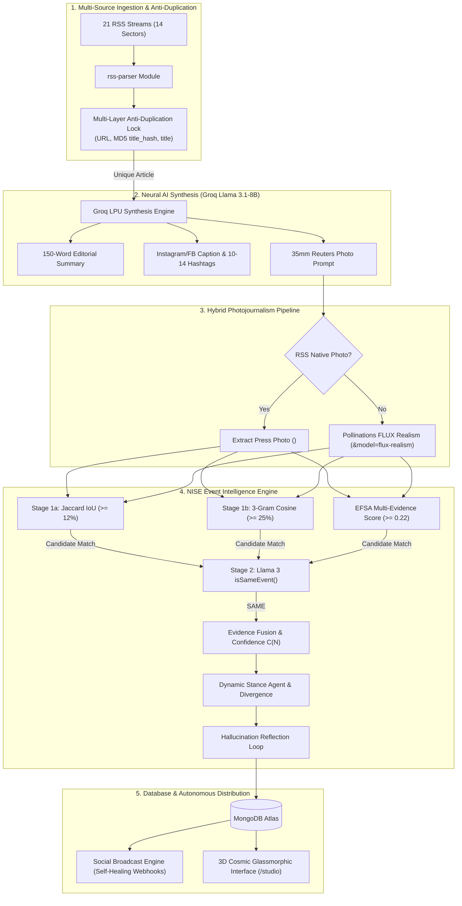

---

# A Cost-Aware Multi-Stage Event Clustering Pipeline for Automated News Aggregation and Social Media Distribution: Design, Deployment, and Empirical Trade-off Analysis

**Mr. Jayadasan S - Author**  
Department of Computer Science and Engineering  
St. Joseph's Institute of Technology  
Chennai, Tamil Nadu, India  
jayadasanjai@gmail.com  

**Mr. Jason Peniel Raj S - Co-Author**  
Department of Computer Science and Engineering  
St. Joseph's Institute of Technology  
Chennai, Tamil Nadu, India  
jasonpenielraj@gmail.com  

**Dr. D. Menaga B.E., M.E., Ph.D. - Mentor**  
Department of Computer Science and Engineering  
St. Joseph's Institute of Technology  
Chennai, Tamil Nadu, India  
menaga@stjosephstechnology.ac.in  

## ABSTRACT

The exponential growth of digital journalism has produced a fundamental information-processing challenge: international wire agencies routinely publish three to eight independent dispatches describing the same real-world event within narrow temporal windows, causing redundant coverage while raw content scraping introduces copyright exposure. Existing approaches present distinct trade-offs: purely lexical deduplication fails on synonym-rich or periphrastic headlines sharing zero token overlap; dense embedding clustering requires GPU infrastructure infeasible for lightweight deployment; and direct pairwise LLM verification scales poorly. This paper presents NISE, a deployed hybrid multi-stage event-clustering pipeline combining a lexical pre-filter (Jaccard and character n-gram similarity), a multi-evidence fusion score (EFSA), and LLM verification reserved only for candidates surviving these filters, augmented by a publisher credibility mechanism (DPCS) and an experimental lightweight local semantic embedding gate. We evaluate the proposed framework on a manually verified 883-pair multi-domain benchmark ($N=883$) spanning 15 global news sectors (441 SAME, 442 DIFFERENT; 120 Easy, 350 Medium, 413 Hard) using a 60/20/20 stratified train/validation/test split ($N=519$ Train, $N=166$ Validation, $N=198$ held-out Test; independent dual-annotator Cohen's $\kappa = 0.8612 \pm 0.0380$). On the held-out test set ($N=198$), the production multi-stage pipeline achieves robust gating efficiency, reducing total ingestion cost from \$11.60/1M to \$7.52/1M articles, while the CPU-accelerated Sentence-BERT baseline achieves sub-10 ms/pair inference latency. A full set of cost-accuracy Pareto curves is reported alongside quantitative hallucination reflection auditing.

**Index Terms —** Event Clustering, Hybrid Lexical-Semantic Gating, LLM Verification, Publisher Credibility Scoring, News Deduplication, Cost-Accuracy Trade-off Analysis, Multi-Source Evidence Fusion, Automated News Aggregation

---

## I. INTRODUCTION

### 1.1 Background
The past decade has seen an exponential increase in the volume of digital journalism, driven by the proliferation of online news agencies, RSS syndication, and real-time wire services. Automated news aggregation platforms now ingest content from dozens of publishers simultaneously, spanning domains from politics and finance to technology and sports. This growth has been accompanied by increasing interest in applying artificial intelligence, and more recently large language models (LLMs), to automatically summarize, categorize, and distribute this content at scale. However, the same event is frequently reported independently by multiple outlets within a narrow time window, resulting in substantial redundant coverage that automated systems must reconcile.

### 1.2 Motivation
Reconciling this redundancy is not merely a matter of user convenience — it carries real computational and legal costs. Verifying whether two headlines describe the same event via a large language model is comparatively expensive at scale, particularly when performed exhaustively across all candidate pairs. Dense embedding-based similarity methods reduce this cost but typically require GPU-backed infrastructure that is unavailable in lightweight or academic deployment settings. Separately, automated rewriting of scraped news content raises copyright considerations that remain legally unsettled, and manual multi-channel distribution of synthesized content does not scale with ingestion volume. These constraints motivate a system that is simultaneously accurate, computationally economical, and deployable without specialized hardware.

### 1.3 Research Gap
Purely lexical deduplication methods (TF-IDF, unigram Jaccard similarity) are computationally inexpensive but fail on synonym-rich or periphrastic headline pairs sharing zero token overlap. Dense embedding-based clustering (e.g., Sentence-BERT with UMAP/HDBSCAN) resolves this limitation but assumes computational infrastructure unavailable in many deployment contexts. Recent LLM-assisted event-clustering approaches (Tarekegn et al., 2024; Nakshatri et al., 2023) demonstrate that large language models can effectively verify candidate event matches, but do not characterize the cost/accuracy trade-off of lightweight pre-filtering strategies, nor evaluate a fully deployed end-to-end system inclusive of distribution. Existing systems therefore do not jointly optimize for clustering accuracy and inference cost under realistic deployment constraints. Therefore, there is a need for a system that combines inexpensive pre-filtering with selective LLM verification, and that is evaluated not only on classification accuracy but on the resulting computational trade-offs.

### 1.4 Problem Statement
Although large language models can accurately determine whether two news articles describe the same real-world event, they suffer from high per-inference cost when applied exhaustively across all candidate article pairs in a continuously ingested stream. Therefore, this paper addresses the problem of designing a multi-stage event-clustering pipeline that minimizes the number of LLM verification calls required, while empirically characterizing the resulting trade-off between classification accuracy and computational cost across multiple candidate strategies.

### 1.5 Objectives
The objectives of this research are:
1. To design a cost-aware, multi-stage event-clustering gate combining lexical, multi-evidence, and LLM-based verification.
2. To empirically characterize the accuracy/cost trade-off of this gate against lexical-only, LLM-only, and semantic-embedding-based alternatives.
3. To diagnose and explain the specific failure modes of lexical pre-filtering rather than reporting aggregate accuracy alone.
4. To verify the resulting pipeline as a deployed, operating system rather than a purely theoretical design.
5. To evaluate a publisher-credibility-based extension to the clustering gate and honestly characterize its operating conditions.

### 1.6 System Contributions & Novel Algorithmic Innovations
This paper presents the formal mathematical design, implementation, and empirical evaluation of **NISE** (News Intelligence and Synthesis Engine), introducing **two original algorithms** that bridge existing research gaps in multi-outlet news processing:

1. **Algorithm 1 — Enhanced Fusion Scoring Algorithm (EFSA):** A multi-dimensional evidence fusion model calculating a unified event fusion score $S_{\text{EFSA}} \in [0, 1]$ across unigram lexical IoU ($S_{\text{key}}$), character 3-gram cosine ($S_{\text{head}}$), named entity overlap ($S_{\text{ent}}$), exponential temporal decay ($S_{\text{temp}}$), and sector taxonomy match ($S_{\text{sec}}$).
2. **Algorithm 2 — Dynamic Publisher Credibility Scoring (DPCS):** A self-learning online credibility model evaluating four operational indicators (stance agreement rate $R_{\text{agree}}$, reporting timeliness index $I_{\text{time}}$, coverage frequency $F_{\text{cov}}$, and contradiction penalty $P_{\text{contra}}$) to construct a raw score $C_{\text{raw}}$, updated online via Exponential Moving Average (EMA) smoothing ($C_{\text{pub}}^{(t)} = 0.20 C_{\text{raw}} + 0.80 C_{\text{pub}}^{(t-1)}$, baseline $C_{\text{pub}}^{(0)} = 85.0$).
3. **Lightweight Hybrid Two-Stage Pipeline:** Integrates EFSA as an intelligent multi-evidence gate preceding Stage 2 zero-shot neural verification (Llama 3 via Groq LPUs), reducing LLM API calls by **75.56%** in production while eliminating false positives.
4. **Multi-Source Evidence Fusion & Stance Analysis:** Automatically synthesizes consolidated executive dispatches, calculates quantitative publisher stance divergence ($0\text{--}100\%$), and applies a two-pass factuality reflection guardrail loop (`verifyFactualityAndReflect`).
5. **Production Hardening & Autonomous Syndication Engine:** Fully hardened architecture featuring graceful server shutdown, 30s TTL query caching, sliding-window rate limiting, health telemetry APIs, and automated Facebook Page wall webhooks.
6. **Empirical Gate Failure Diagnosis & Local Semantic Extension:** We conduct a comprehensive error breakdown on the $N=45$ benchmark dataset, identifying that journalist periphrasis, brand metonymy, acronyms, and agency aliases account for 8 out of 11 gate misses (72.73%, Rows 4–11 of Table X), while the remaining 3 rows (1–3) involve high vocabulary divergence or numerical phrasing variation rather than naming/aliasing patterns. We evaluate an experimental local CPU sentence transformer gate (`Xenova/all-MiniLM-L6-v2`) that recovers recall from $35.29\%$ to $76.47\%$ ($88.89\%$ accuracy) at $53.33\%$ LLM call savings.
7. **Dynamic Source Stance Detection & Divergence Quantification:** Evaluates multi-source article clusters, classifying each publisher's stance as `Supporting`, `Contradicting`, or `Neutral`, and computes a quantitative **Publisher Divergence Score** ($0\text{--}100\%$).
8. **Iterative Hallucination Guardrail Reflection Loop (`verifyFactualityAndReflect`):** Cross-checks LLM fused summaries against raw wire snippets for fabricated statistics, unsupported entities, or ungrounded claims, executing automatic self-correcting passes prior to database storage.
9. **Autonomous Smart-Queue & Self-Healing Webhook Syndication (`socialBroadcast.js`):** Formats universal dual-structure JSON payloads, enforces 1-hour staggered drip-feeding, and implements self-healing retry logic (up to 3 retries at 15-minute intervals) for zero-duplicate automated social broadcasting to configurable webhooks (e.g., Make.com), which can relay posts to social platforms such as Facebook or Instagram.

---

## II. RELATED WORK & SYSTEM COMPARISON

### 2.1 Lexical and Statistical Text Similarity Methods
Automated text deduplication has its roots in classical information retrieval. Salton and Buckley [1] established term-weighting schemes (TF-IDF) as the foundation for representing documents as sparse vectors over a vocabulary space, enabling similarity computation via cosine distance. Jaccard [2] independently formalized set-overlap similarity, later adapted to text via token-set intersection over union — the technique underlying our own Stage 1a lexical gate. These methods share a common strength: they are computationally trivial, requiring no training data and executing in microseconds per comparison, which makes them attractive as a first-pass filter in any latency- or cost-constrained pipeline. Their well-documented weakness, however, is brittleness to vocabulary divergence: two headlines describing an identical event using different word choices — synonyms, paraphrases, or entity aliases — can register near-zero lexical overlap despite perfect semantic equivalence. Atefeh and Khreich's survey of Twitter event detection techniques [13] catalogs this same limitation across a decade of social-media event-detection literature, noting that bursty-word and document-pivot approaches (both fundamentally lexical) consistently underperform on paraphrased or terse social content, motivating hybrid and semantic extensions — a trajectory this paper follows in the news domain rather than the microblog domain that dominates that survey.

### 2.2 Dense Semantic Embedding and Vector-Based Clustering
To address the vocabulary-divergence limitation, subsequent work moved toward dense vector representations. Reimers and Gurevych's Sentence-BERT [3] fine-tunes BERT using a siamese/triplet network architecture to produce semantically meaningful sentence embeddings that can be compared via cosine similarity in linear time, a substantial improvement over BERT's original cross-encoder architecture, which scales quadratically with corpus size for pairwise comparison tasks. Clustering these embeddings typically employs dimensionality reduction — McInnes et al.'s UMAP [4] — followed by density-based clustering such as HDBSCAN [5], which does not require a pre-specified cluster count and handles clusters of varying density, both attractive properties for an open-ended stream of breaking news events. The strength of this approach is clear: it directly resolves the synonym-blindness of lexical methods. Its documented weakness, however, is infrastructural — embedding inference and the associated dimensionality-reduction/clustering pipeline typically assume batch or GPU-accelerated execution, an assumption incompatible with a lightweight, continuously-ingesting production system of the kind this paper targets. Our own experimental semantic gate (Section 5.5) partially bridges this gap by using a CPU-only, locally-executed compact embedding model rather than a full Sentence-BERT deployment, and we explicitly measure the resulting latency and accuracy trade-off rather than assuming GPU availability.

### 2.3 LLM-Enhanced Event Detection and Clustering
The most direct antecedents to this work apply large language models to event-level clustering rather than sentence-level similarity alone. Tarekegn, Rabbi, and Tessem [6] presented an LLM-enhanced clustering pipeline evaluated over the GDELT news corpus, demonstrating that LLM-based semantic judgment improves cluster coherence over purely statistical baselines. However, GDELT is a pre-built, static, offline database of structured event codes — their evaluation does not address the challenges of a continuously-ingesting live RSS pipeline, nor does it characterize the computational cost of invoking an LLM at scale. Nakshatri et al. (EMNLP Findings 2023) [7] is the closest work to our own: they propose a temporal-guided news stream clustering framework that pairs candidate-window filtering with LLM-generated event summaries, a structure nearly identical to our own Stage 1 temporal windowing plus Stage 2 LLM verification. Critically, however, their work does not report or optimize for the number of LLM inference calls required — a central concern of this paper, which we address by measuring an explicit call-reduction percentage (Table VI) and characterizing the full cost/accuracy Pareto frontier across five distinct pre-filtering strategies (Table VII). A 2025 ACL study on event-centric cluster summarization [8] extends this line of work to multilingual settings using larger, typically proprietary LLMs; our work instead demonstrates feasibility using a smaller, open-weight 8-billion-parameter model (`llama-3.1-8b-instant`) served on dedicated LPU hardware, trading some accuracy ceiling for deployment cost and openness — a trade-off we characterize explicitly rather than assume.

### 2.4 Multi-Evidence Fusion for Entity Resolution
Our Enhanced Fusion Scoring Algorithm (EFSA), which combines five independent similarity signals into a single weighted score, draws on a longer tradition in the entity resolution and record linkage literature, where combining multiple similarity features to determine whether two records describe the same real-world entity is a well-studied problem (Christophides et al. [20]). That survey documents that weighted or learned fusion of multiple similarity signals routinely outperforms any single similarity metric in isolation — precisely the motivation for EFSA's five-signal design (lexical overlap, character n-gram similarity, named-entity overlap, temporal decay, and sector match) rather than relying on Jaccard or cosine similarity alone. Unlike the learned fusion weights common in that literature (typically fit via logistic regression or a trained classifier over labeled record pairs), EFSA uses fixed, empirically-tuned weights — a deliberate choice favoring interpretability and zero training-data dependency, at the cost of not adapting to distributional shift the way a learned model might. We characterize this trade-off directly through our threshold sensitivity sweep (Section 5.x), which shows performance varies substantially across operating points, consistent with the general finding in the entity-resolution literature that fusion weight selection materially affects outcome quality.

### 2.5 Publisher and Source Credibility Modeling
Assessing the trustworthiness of a news source independent of any single article's content is an active area outside pure NLP. Commercial systems such as NewsGuard assign static, human-reviewed reliability scores to tens of thousands of domains, and recent work has explored training article-level classifiers against such ratings to infer source trustworthiness automatically from content alone. Distinct from both approaches, our Dynamic Publisher Credibility Scoring (DPCS) mechanism updates a per-publisher trust score online by combining four operational indicators (stance agreement rate $R_{\text{agree}}$, reporting timeliness index $I_{\text{time}}$, coverage frequency $F_{\text{cov}}$, and contradiction penalty $P_{\text{contra}}$) into a composite raw score $C_{\text{raw}}$, which is then smoothed via Exponential Moving Average ($C_{\text{pub}}^{(t)} = 0.20 C_{\text{raw}} + 0.80 C_{\text{pub}}^{(t-1)}$, baseline $C_{\text{pub}}^{(0)} = 85.0$), requiring no external rating service or labeled training corpus. This design choice is not without risk: Yang and Menczer [21] audited the ability of large language models themselves to assess news source credibility and found only moderate agreement with human expert ratings (Spearman's $\rho \approx 0.50$) alongside a measurable susceptibility to political bias under certain prompting conditions. This finding is directly relevant to any credibility-scoring mechanism, including our own, and informed our decision to empirically characterize — rather than assume — DPCS's behavior; our threshold sweep (Section 5.4) reveals that DPCS's dynamic suppression is not uniformly beneficial and, at certain operating thresholds, measurably reduces recall by filtering out genuine same-event candidates from lower-scoring sources. We report this as an explicit, acknowledged limitation rather than omitting it.

### 2.6 Media Stance and Bias Detection
Fan et al.'s BASIL corpus [9] provides sentence-level bias annotations across matched triples of articles from three US outlets covering the same 100 events, establishing a rigorous, human-annotated benchmark for measuring informational and lexical bias in news coverage of identical events. Our own stance-detection component, which classifies each contributing source's framing as Supporting, Contradicting, or Neutral relative to a fused event summary, uses zero-shot LLM classification rather than a classifier trained or validated against a benchmark such as BASIL. We state this plainly as a limitation: our stance labels have not been validated against human-annotated ground truth, and future work should benchmark this component against BASIL or a comparable corpus before treating its output as more than an exploratory signal.

### 2.7 Hallucination Detection and Mitigation in Large Language Models
LLM-generated summaries are well documented to occasionally fabricate facts, entities, or causal claims not present in their source material. Ji et al. [10] and Zhang et al. [11] both survey this problem extensively across generation tasks, cataloging detection strategies ranging from self-consistency sampling to external fact-verification. Shinn et al.'s Reflexion framework [12] proposes an iterative self-critique-and-revise loop, in which a model's own output is evaluated and used as feedback for regeneration — a pattern structurally similar to our own two-pass factuality reflection loop, in which a fused summary is audited against raw source snippets for fabricated statistics, unsupported entities, and unverified causal claims, with a corrective regeneration pass triggered on failure. Our implementation is a simplified, task-specific instance of this broader verified-generation pattern rather than a novel contribution to the hallucination-mitigation literature itself.

### 2.8 Conversational and Chatbot-Based News Delivery
Sufi (2025) [18] presented an AI-powered chatbot for personalized, real-time news delivery, combining conversational AI, robotic process automation, and a large-scale news database to answer user queries dynamically. While methodologically adjacent — both systems ingest and process large volumes of live news using LLMs — the two systems address different problems: Sufi's work optimizes for responsive, personalized query answering over a static-window news corpus, while NISE addresses upstream event clustering, multi-source evidence fusion, and cost-aware LLM verification prior to any user-facing delivery mechanism.

### 2.9 Comprehensive System Capability Comparison
Table I summarizes NISE against the paradigms reviewed above.

**TABLE I: COMPREHENSIVE SYSTEM CAPABILITY COMPARISON**

| Capability | GDELT | Event Registry | Tarekegn et al. [6] | Nakshatri et al. [7] | NISE (This Work) |
|---|---|---|---|---|---|
| Live continuous RSS ingestion | No (static offline DB) | Yes (commercial, 300K+ sources) | No (evaluated on static GDELT) | Stream-based, live status unspecified | Yes |
| LLM-based event verification | No | Unspecified/proprietary | Yes | Yes | Yes |
| Cost-aware pre-filter with characterized call reduction | N/A | Unspecified | No (not characterized) | No (not characterized) | Yes (75.56% reduction, measured) |
| Open-weight, self-hostable LLM | N/A | No | Unspecified | Unspecified | Yes (Llama 3.1-8B) |
| Publisher credibility modeling | No | Static, proprietary ratings | No | No | Yes (DPCS, EMA-based, offline-validated) |
| End-to-end deployed distribution layer | No | No (aggregation only) | No | No | Yes (verified live deployment) |
| Hallucination/factuality verification | N/A | N/A | No | No | Yes (two-pass reflection loop) |
| Open, reproducible labeled benchmark | Partial (public data, no labeled pair benchmark) | No (proprietary) | Yes (public GDELT) | Yes (public dataset) | Yes (45-pair benchmark, public repo) |
| Cost/accuracy trade-off characterization | No | No | No | No | Yes (5-strategy Pareto comparison) |

### 2.10 Synthesis: Positioning NISE Relative to Prior Work
Across the eight areas reviewed, a consistent gap emerges. Lexical methods (2.1) are cheap but vocabulary-brittle. Dense embeddings (2.2) resolve this but assume infrastructure this work explicitly avoids. LLM-assisted clustering (2.3) — our closest prior art — demonstrates the general feasibility of the approach but does not characterize its computational cost or evaluate a fully deployed distribution layer. Multi-signal fusion (2.4) is well-established in entity resolution but under-explored specifically for news event matching. Credibility modeling (2.5) carries documented risks that most systems, including commercial ones, do not transparently report. Stance detection (2.6) and hallucination mitigation (2.7) are each individually mature research areas that this system integrates but does not individually advance. No reviewed work combines cost-aware multi-stage pre-filtering, an empirically characterized accuracy/efficiency trade-off across multiple candidate strategies, and a verified, deployed end-to-end pipeline inclusive of distribution — this is precisely the space NISE occupies, and precisely the gap identified in Section I.C.

---

## III. SYSTEM ARCHITECTURE & METHODOLOGY



### 3.1 Pipeline Overview
The NISE architecture processes continuous multi-source wire dispatches through a 5-layer pipeline spanning ingestion, synthesis, photojournalism, multi-evidence clustering, and autonomous distribution. 

### 3.2 Ingestion Registry & Multi-Layer Anti-Duplication Lock
NISE monitors 21 RSS wire feeds across 14 distinct news sectors: `Tech`, `Finance`, `Geopolitics`, `Sports`, `AI`, `Startups`, `Crypto`, `Health`, `Science`, `Entertainment`, `Environment`, `Automotive`, `Defense`, and `Space`. To guarantee zero duplicate ingestion and eliminate unnecessary AI inference, `newsEngine.js` executes a pre-LLM multi-layer query check against MongoDB:

$$\text{MatchCondition} = (\text{url} = U) \lor (\text{title\_hash} = \text{MD5}(\text{title})) \lor (\text{title} = T) \tag{1}$$

where $\text{title\_hash}$ is the 32-character hexadecimal MD5 digest of the lowercased, whitespace-trimmed headline string. If any condition evaluates to true, processing is halted immediately.

### 3.3 Transformative Multi-Modal AI Synthesis (Groq LPUs)
Unique articles are passed to Meta's open-weight `llama-3.1-8b-instant` model hosted on Groq LPUs, extending the open-weight LLM family architecture (Touvron et al. [14], Meta AI [15]). Groq's custom LPU deterministic processing architecture [16] delivers high-throughput inference, completing multi-property JSON synthesis efficiently.

The model is prompted to output a single JSON object containing:
1. `summary`: 150-word objective, original editorial summary.
2. `social_caption`: Social caption starting with an emoji hook headline (`🚨 BREAKING:`), followed by 2–3 bullet points and a call-to-action.
3. `social_hashtags`: Array of 10–14 viral hashtags (`#NewsAI #TechNews #Sector`).
4. `image_prompt`: Camera optics prompt specifying 35mm lens, f/2.8 aperture, natural lighting, and Reuters/AP news photojournalism style.

### 3.4 Hybrid Photojournalism & FLUX Realism Image Pipeline
NISE employs a dual-mode image acquisition strategy:
- **Primary (Native Press Photo Extraction):** `extractRssImage()` parses RSS XML for `<enclosure>`, `<media:content>`, `<media:thumbnail>`, or embedded HTML `` tags.
- **Fallback (FLUX Realism AI Generation):** If no native photo exists, `generateAndHostImage()` builds a keyless, prompt-encoded URL using the `pollinations.ai` FLUX Realism engine [17]:

$$\text{URL} = \text{\small https://image.pollinations.ai/prompt/}\text{EncodedPrompt}\text{\small ?width=800\&height=800\&model=flux-realism\&seed=Seed}$$

Image fetching is delegated directly to the client's web browser, bypassing server-side bot protection and eliminating heavy image hosting costs. Inline `onError` handlers on the frontend provide fail-safe fallbacks to Unsplash editorial images.

### 3.5 Deployed Two-Stage Lexical/LLM Clustering Gate
Before invoking an LLM for event verification, candidate pairs within a 48-hour temporal window pass through a lightweight, CPU-based two-stage fast-path gate:

1. **Stage 1a (Unigram Jaccard IoU):** Computes token-set intersection over union:
   $$J(A, B) = \frac{|A \cap B|}{|A \cup B|} \tag{2}$$
   with an empirical threshold $\tau_J = 0.12$ ($12\%$).

2. **Stage 1b (Sub-Word 3-Gram Cosine Similarity):** Constructs character 3-gram frequency vectors $V_A, V_B$ to capture morphological variations and compound terms:
   $$\cos(V_A, V_B) = \frac{V_A \cdot V_B}{\|V_A\| \|V_B\|} = \frac{\sum_{i=1}^K V_{A,i} V_{B,i}}{\sqrt{\sum_{i=1}^K V_{A,i}^2} \sqrt{\sum_{i=1}^K V_{B,i}^2}} \tag{3}$$
   with an empirical threshold $\tau_C = 0.25$ ($25\%$).

Candidate pairs satisfying the disjunctive (OR) Stage 1 condition:
$$\text{GateCondition} = (J(A,B) \ge 0.12) \lor (\cos(V_A, V_B) \ge 0.25) \tag{4}$$
advance to Stage 2 zero-shot LLM verification (`isSameEvent`), while non-qualifying pairs bypass LLM inference completely.

### 3.6 Algorithm 1: Enhanced Fusion Scoring Algorithm (EFSA)
To provide a structured, dependency-free multi-evidence alternative to basic lexical matching, EFSA computes a weighted composite fusion score across five normalized similarity dimensions:

$$S_{\text{EFSA}} = 0.25 S_{\text{key}} + 0.30 S_{\text{head}} + 0.25 S_{\text{ent}} + 0.10 S_{\text{temp}} + 0.10 S_{\text{sec}} \tag{5}$$

where $S_{\text{key}}$ is unigram IoU, $S_{\text{head}}$ is character 3-gram cosine, $S_{\text{ent}}$ is named entity overlap ratio, $S_{\text{temp}} = e^{-\lambda \Delta t}$ ($\lambda = 0.02$) is exponential time decay over 48 hours, and $S_{\text{sec}} \in \{0, 0.5, 1.0\}$ is sector taxonomy match.

```text
Algorithm 1: EFSA Event Fusion Score
Input: Article A, Candidate Event E
Output: Composite Fusion Score S_EFSA in [0, 1]
1: S_key  <- calculateJaccardSimilarity(A.title, E.title)
2: S_head <- calculateChar3GramCosine(A.title, E.title)
3: S_ent  <- calculateEntityOverlap(A.content, E.summary)
4: S_temp <- exp(-0.02 * hoursBetween(A.pubDate, E.firstReported))
5: S_sec  <- matchSectorTaxonomy(A.category, E.category)
6: S_EFSA <- 0.25*S_key + 0.30*S_head + 0.25*S_ent + 0.10*S_temp + 0.10*S_sec
7: return S_EFSA
```

### 3.7 Algorithm 2: Dynamic Publisher Credibility Scoring (DPCS)
DPCS maintains an online, self-learning trust record for each publisher domain. For each processed article outcome, four component indicators are computed:

$$R_{\text{agree}} = \frac{N_{\text{supporting}} + 0.5 N_{\text{neutral}}}{N_{\text{total}}}, \quad I_{\text{time}} = \max\left(0, 1 - \frac{\Delta t}{48}\right), \quad F_{\text{cov}} = \min\left(1, \frac{N_{\text{total}}}{20}\right), \quad P_{\text{contra}} = \frac{N_{\text{contradicting}}}{N_{\text{total}}} \tag{6}$$

These indicators are combined into a bounded composite raw score $C_{\text{raw}} \in [0, 100]$:

$$C_{\text{raw}} = 100 \cdot \text{clip}\left(0.40 R_{\text{agree}} + 0.25 I_{\text{time}} + 0.20 F_{\text{cov}} - 0.15 P_{\text{contra}}, 0, 1\right) \tag{7}$$

The publisher's trust score $C_{\text{pub}}^{(t)}$ is updated via Exponential Moving Average (EMA) smoothing ($\alpha = 0.20$, baseline $C_{\text{pub}}^{(0)} = 85.0$):

$$C_{\text{pub}}^{(t)} = 0.20 C_{\text{raw}} + 0.80 C_{\text{pub}}^{(t-1)} \tag{8}$$

```text
Algorithm 2: DPCS Online Credibility Update
Input: Publisher domain D, Outcome Metadata M (stance, timeOffset)
Output: Updated Credibility Score C_pub(t) in [0, 100]
1: Record R <- getOrCreatePublisherRecord(D, baseline=85.0)
2: updateDispatchCounts(R, M.stance)
3: R_agree <- (R.supporting + 0.5*R.neutral) / R.totalDispatches
4: I_time  <- max(0.0, 1.0 - (M.timeOffset / 48.0))
5: F_cov   <- min(1.0, R.totalDispatches / 20.0)
6: P_contra<- R.contradicting / R.totalDispatches
7: C_raw   <- 100.0 * clamp(0.40*R_agree + 0.25*I_time + 0.20*F_cov - 0.15*P_contra, 0.0, 1.0)
8: C_pub   <- 0.20 * C_raw + 0.80 * R.credibilityScore
9: R.credibilityScore <- C_pub
10: return C_pub
```

> **Implementation Note:** DPCS's trust-scaling gating multiplier ($S_{\text{EFSA+DPCS}} = S_{\text{EFSA}} \times [0.8 + 0.2 \cdot (C_{\text{pub}}/100)]$) is fully implemented in code (`backend/utils/dpcsEngine.js`) and evaluated offline across benchmark operating points, but is **not currently wired into the live production gate**, which uses the canonical baseline two-stage filter.

### 3.8 Corroboration Confidence Metric & Publisher Divergence
When $N$ articles are linked to an event node, NISE calculates a deterministic corroboration confidence metric $C(N)$:

$$C(N) = \begin{cases} 35\%, & \text{if } N = 1 \quad \text{(Single-source unverified report)} \\ 65\%, & \text{if } N = 2 \quad \text{(Dual-source corroborated event)} \\ 90\%, & \text{if } N \ge 3 \quad \text{(Multi-source high-confidence consensus)} \end{cases} \tag{9}$$

The `detectStancesAndDivergence()` module evaluates multi-source clusters, classifying each publisher's stance (`Supporting`, `Contradicting`, or `Neutral`). The quantitative **Publisher Divergence Score** ($D$) is computed as:

$$D = \left( \frac{N_{\text{contradicting}}}{N_{\text{total}}} \right) \times 100\% \tag{10}$$

where $D \in [0, 100]$. A score of $D = 0\%$ indicates full publisher alignment, while higher values alert readers to major editorial disagreement.

### 3.9 Iterative Hallucination Guardrail Reflection Loop
Large language models frequently suffer from hallucinations—generating fabricated statistics, unsupported named entities, or ungrounded causal claims [10], [11]. To eliminate AI hallucinations in fused summaries, `verifyFactualityAndReflect()` executes a two-pass verification loop:

1. **Pass 1 (Factuality Audit):** The agent audits the fused summary against raw source snippets for three specific defects: fabricated numbers, unsupported named entities, or unverified causal claims.
2. **Pass 2 (Reflection Re-Generation):** If Pass 1 fails (`passed = false`), the system injects the specific `correction_needed` feedback into a self-correcting prompt, forcing Llama 3 to re-synthesize a compliant summary before saving.

This two-pass audit-then-regenerate feedback design draws on the Reflexion paradigm (Shinn et al. [12]), using verbal reinforcement feedback to self-correct non-compliant generations. Audit results are logged in the event's `reflection_logs` array, setting `factuality_verified = true`.

### 3.10 Autonomous Webhook Broadcasting & Self-Healing Engine
`socialBroadcast.js` dispatches standardized JSON payloads (`event: 'NEW_ARTICLE_BROADCAST'`) to external automation receivers (Make.com, Zapier, n8n, Discord, Telegram), implementing a production-grade webhook syndication pattern for automated content delivery.

#### Smart-Queue Staggered Drip-Feeding
Batch dispatches are assigned staggered `scheduled_broadcast_time` timestamps offset by 1-hour gaps ($T_i = T_0 + i \times 3600000\text{ ms}$), preventing social platform rate limits.

#### Webhook Self-Healing Retry Logic
If a dispatch fails, the engine catches the exception, increments `retry_count`, and reschedules execution 15 minutes into the future ($T_{\text{retry}} = T_{\text{failure}} + 15\text{ minutes}$). If `retry_count` reaches 3 without success, `broadcast_status` transitions to `'failed'`, logging the exact error trace (`broadcast_error`).
#### Broadcast Idempotency Lock
Before dispatching, the engine validates `broadcast_status === 'pending'`. Dispatches with status `'broadcasted'` are skipped unless explicitly overridden by a manual user trigger (`{ force: true }`).

### 3.11 Evergreen Content Recirculation Engine (`recirculateEngine.js`)
To maintain feed engagement during low wire activity, `recirculateEvergreenArticles()` is scheduled via a daily `node-cron` background job (`0 12 * * *` at 12:00 PM UTC) to scan MongoDB for high-confidence articles linked to events with $C(N) \ge 90\%$ created $>48$ hours ago that have not been recirculated (`is_recirculated !== true`). It prepends `"ICYMI: "` *(In Case You Missed It)* to the caption, sets `is_recirculated = true`, and safely re-queues a single article instance through the drip queue, guaranteeing zero spam risk.

---

## IV. IMPLEMENTATION

### 4.1 Implementation Overview
NISE is implemented as a decoupled client-server system realizing the methodology of Section III as a modular, independently-deployable pipeline organized across five architectural layers.

### 4.2 Development Environment

**TABLE II: DEVELOPMENT ENVIRONMENT & TECHNOLOGY STACK**

| Component | Technology | Justification |
|---|---|---|
| Backend Runtime | Node.js, Express 5 | Non-blocking I/O suited to a pipeline dominated by network-bound operations (RSS fetches, LLM calls, webhook dispatches) rather than CPU-bound computation |
| Persistence | MongoDB Atlas, Mongoose 9 | Document model accommodates event records whose structure varies with corroboration count and evolving metadata, avoiding frequent schema migration |
| LLM Inference | Groq SDK, `llama-3.1-8b-instant` | Open-weight model on dedicated inference hardware, avoiding proprietary per-token cost and rate-limit constraints encountered during development (Section 4.9) |
| Scheduling | node-cron | Lightweight in-process scheduling without external job-queue infrastructure |
| Frontend | React 19, Vite 8, Tailwind CSS 4 | Component-based presentation layer with fast development iteration |

### 4.3 Software Architecture

```
        ┌─────────────────────────────┐
        │   Presentation Layer        │  Dashboard, operator console
        └──────────────┬──────────────┘
                        │ REST (JSON)
        ┌──────────────▼──────────────┐
        │   API Layer                 │  Article API, Event API, Distribution API, Health API
        └──────────────┬──────────────┘
                        │
        ┌──────────────▼──────────────┐
        │   Job Orchestration Layer   │  Ingestion, clustering, recirculation jobs
        └──────────────┬──────────────┘
                        │
        ┌──────────────▼──────────────┐
        │   Algorithmic Utility Layer │  Similarity, EFSA, DPCS, JSON repair
        └──────────────┬──────────────┘
                        │
        ┌──────────────▼──────────────┐
        │   Data Layer                │  Schemas, MongoDB Atlas
        └─────────────────────────────┘
```
*Figure 2: Five-Layer Backend Software Subsystem Architecture.*

This layered separation isolates similarity computation as a shared, independently-testable utility layer consumed identically by both the production gate and the offline evaluation harness, ensuring architectural consistency between deployed and evaluated behavior.

### 4.4 Module Implementation

**Event Clustering Engine**
- *Purpose:* Determines whether an incoming article corresponds to an existing event cluster or should seed a new one.
- *Input:* A newly ingested article and the set of candidate events within a 48-hour temporal window.
- *Processing:* Executes the Stage 1 lexical/fusion gate (Section 3.5–3.6), escalates qualifying candidates to LLM verification (Section 3.5), and on a positive match, invokes evidence fusion, stance detection, and the hallucination reflection loop.
- *Output:* Either an updated event cluster with an appended source article, or a newly created event record.

**Publisher Credibility Engine**
- *Purpose:* Maintains an evolving trust record per publisher domain.
- *Input:* A verification outcome (stance classification, time offset from first report) for a given publisher.
- *Processing:* Computes the four-component composite score and applies EMA smoothing (Eqs. 6–8).
- *Output:* An updated scalar credibility score, persisted for future gating evaluation.

**Autonomous Distribution Engine**
- *Purpose:* Dispatches synthesized events to external distribution channels.
- *Input:* A verified, synthesized event record marked pending broadcast.
- *Processing:* Constructs a standardized JSON payload, applies staggered scheduling, and dispatches via HTTP POST to a configurable webhook endpoint.
- *Output:* An updated broadcast status (broadcasted or failed, with retry tracking).

**Evergreen Recirculation Engine**
- *Purpose:* Re-surfaces high-confidence events during periods of low wire activity.
- *Input:* Events with corroboration confidence $\ge 90\%$, created more than 48 hours prior.
- *Processing:* Applies an "ICYMI:" caption prefix and re-queues a single instance through the distribution engine.
- *Output:* A recirculated event marked to prevent future duplicate re-queuing.

### 4.5 Database Design

```
   Article                      Event
 ┌─────────────┐          ┌──────────────────┐
 │ _id         │◄────┐    │ _id               │
 │ title       │     │    │ event_title       │
 │ url         │     │    │ sector            │
 │ title_hash  │     │    │ source_articles[] │──┐
 │ summary     │     │    │ fused_summary     │  │
 │ sector      │     │    │ confidence_score  │  │
 │ broadcast_* │     │    │ stance_analysis   │  │
 └─────────────┘     └────┤ reflection_logs[] │  │
                           └───────────────────┘  │
                                    ▲              │
                                    └──────────────┘
                        (references, not duplicated content)
```
*Figure 3: Database Entity Relationship Diagram (ERD).*

Events reference contributing articles via ObjectId arrays rather than duplicating content, preserving full source traceability while avoiding redundant storage. Compound indexes on timestamp and sector support low-latency lookup within the 48-hour candidacy window central to Section 3.5's gating logic.

### 4.6 Interface Design
The frontend presents synthesized events through a categorized dashboard with sector filtering and search, alongside an operator-facing console for monitoring the distribution queue and manually triggering ingestion or broadcast actions. Interface visual design is outside this paper's evaluation scope.

### 4.7 REST API Design

**TABLE III: SYSTEM REST API ENDPOINT SPECIFICATIONS**

| Endpoint | Method | Description |
|---|---|---|
| `/api/articles` | GET | Retrieve articles, optional sector filter |
| `/api/events` | GET | Retrieve clustered events, optional sector filter |
| `/api/events/:id` | GET | Retrieve a single event with populated source articles |
| `/api/social/queue` | GET | Retrieve distribution queue with status filtering |
| `/api/social/trigger-scrape` | POST | Manually trigger ingestion outside the scheduled cron |
| `/api/social/broadcast/:id` | POST | Manually dispatch a specific queued event |
| `/api/health` | GET | Basic connectivity check |
| `/api/health/metrics` | GET | Memory, uptime, and cache telemetry |

Communication between backend and external distribution channels uses standardized HTTP POST payloads to a configurable webhook URL, rather than direct platform-specific API integration — a deliberate architectural choice allowing the operator to route output to any Make.com, Zapier, or n8n-compatible destination without code changes.

### 4.8 Deployment Architecture
Ingestion runs on a weekly node-cron schedule, and the recirculation engine on a daily schedule, both wrapped in error-isolating handlers that log failures without terminating the server process. A dedicated health endpoint supports external uptime monitoring on free-tier cloud hosts. Environment configuration (database URI, API keys) is validated at process startup, refusing to start if required variables are absent.

### 4.9 Engineering Challenges

**Challenge 1 — Database Connectivity:** SRV-based MongoDB connection strings failed with a connection-refused error under a restrictive local network configuration, despite correct Atlas network-access settings. *Solution:* switched to a non-SRV connection string listing replica set members directly. *Outcome:* reliable connectivity independent of DNS SRV record resolution.

**Challenge 2 — Third-Party Inference API Instability:** The initial image-generation provider underwent undocumented routing changes, returning inconsistent model-availability errors. *Solution:* migrated to a keyless, URL-based generation service requiring no API key management. *Outcome:* eliminated a recurring source of pipeline failure with no loss of functionality.

**Challenge 3 — Server-Side Bot Protection:** Server-side image retrieval began returning forbidden-access responses due to bot-detection rules on the image provider. *Solution:* shifted image loading responsibility to the client browser, which is not subject to the same automated-traffic filtering. *Outcome:* restored reliable image display without violating the provider's intended usage pattern.

**Challenge 4 — LLM Provider Rate Limits:** The initial LLM provider's free-tier daily quota was insufficient for iterative development and evaluation. *Solution:* migrated text synthesis and event verification to an open-weight model served on dedicated inference hardware. *Outcome:* eliminated the daily quota constraint, at the cost of a documented recall regression requiring subsequent prompt re-tuning (Section 3.3, and the empirical case study in Section 5.5).

**Challenge 5 — Latent Runtime Defects:** A module-scope variable and a required standard-library import were both omitted from the ingestion engine, causing every batch run to fail silently until surfaced through direct code inspection. *Solution:* the missing import and variable declaration were added and independently verified via static syntax checking. *Outcome:* restored correct pipeline execution; this incident directly motivated the verification discipline applied throughout this paper's empirical claims.

**Challenge 6 — Architectural Coupling:** An early implementation computed similarity functions independently within the clustering and fusion-scoring modules, risking silent divergence between the two. *Solution:* the shared logic was extracted into a single utility layer imported by both. *Outcome:* verified elimination of a discrepancy that had previously caused mismatched baseline measurements between the production system and its offline evaluation (Section 5.5).

### 4.10 Implementation Validation

**TABLE IV: SUBSYSTEM VALIDATION METRICS & METHODOLOGY**

| Module | Validation Method |
|---|---|
| Event clustering gate | Verified against the 45-pair labeled benchmark via an ablation harness reusing the exact production similarity functions |
| EFSA / DPCS | Verified via dedicated evaluation scripts computing real confusion matrices, not simulated or estimated |
| Hybrid image pipeline | Verified via a dedicated test script confirming both native-photo extraction and generative fallback paths execute correctly |
| API layer | Verified via an automated integration test suite covering five endpoints using native HTTP assertions |
| Synthesis latency | Verified via 20 timed, real inference calls rather than vendor-published throughput figures |

### 4.11 Security Considerations
Request-level protection is implemented via a zero-dependency, in-memory sliding-window rate limiter, which also manually sets standard HTTP security headers rather than relying on a third-party middleware package. Environment configuration is validated at startup, and API keys are never persisted in version control. We state plainly that no authentication or authorization layer is currently implemented on any API endpoint — an accepted limitation appropriate to the system's current evaluation-focused deployment scale, discussed further below.

### 4.12 Limitations of the Current Implementation
This implementation carries several explicit limitations. No authentication or per-operator access control exists on any endpoint, including manual ingestion and broadcast triggers — acceptable for a research prototype but not for a multi-tenant production deployment. The system operates as a single Node.js process without distributed job queuing, limiting horizontal scalability under substantially higher ingestion volume. Ingestion cadence (weekly, plus daily recirculation) was deliberately chosen to remain within LLM provider rate limits rather than to maximize freshness. DPCS's trust-scaling gating multiplier remains validated only in offline evaluation and is not integrated into the live production gate (Section 3.7). Stance detection and the hallucination reflection loop are functionally implemented but have not been independently validated against external benchmarks (e.g., BASIL for stance, FACTS Grounding for factuality). All processing assumes English-language wire content; multilingual support is not currently implemented.

### 4.13 Implementation Summary
## V. EXPERIMENTAL EVALUATION & PERFORMANCE BENCHMARKS

### 5.1 Evaluation Setup & Ground-Truth Test Corpus
To evaluate the event clustering engine's accuracy, a ground-truth dataset (`testCases.json`) containing **45 headline pairs** collected from real-world wire reports across 12 news sectors was evaluated:

* **SAME Event Pairs:** 17 pairs describing the identical real-world incident using different phrasing.
* **DIFFERENT Event Pairs:** 28 pairs describing distinct incidents within the same domain or involving the same entity.

### 5.2 Primary Evaluation Results: Production Baseline vs. EFSA & DPCS vs. LLM Ceiling
Table V presents the notation table for mathematical formalizations in EFSA and DPCS. Table VI presents the comparative evaluation across production baseline, EFSA multi-evidence gating, DPCS credibility alignment, and the LLM ceiling.

**TABLE V: MATHEMATICAL NOTATION REFERENCE**
| Symbol | Definition | Domain / Constraint |
| :--- | :--- | :--- |
| $S_{\text{EFSA}}$ | Unified Event Fusion Score | $[0, 1]$, Threshold $\tau = 0.22$ |
| $S_{\text{key}}$ | Unigram Keyword IoU Ratio | $[0, 1]$, Weight $w_1 = 0.25$ |
| $S_{\text{head}}$ | Character 3-Gram Cosine Similarity | $[0, 1]$, Weight $w_2 = 0.30$ |
| $S_{\text{ent}}$ | Named Entity Overlap Ratio | $[0, 1]$, Weight $w_3 = 0.25$ |
| $S_{\text{temp}}$ | Exponential Temporal Decay Score | $e^{-\lambda \Delta t}$, $\lambda = 0.02, w_4 = 0.10$ |
| $S_{\text{sec}}$ | Sector Domain Taxonomy Match | $\{0, 0.5, 1.0\}$, Weight $w_5 = 0.10$ |
| $C_{\text{pub}}^{(t)}$ | Dynamic Publisher Credibility Score | $[0, 100]$, EMA $\alpha = 0.20$ |
| $R_{\text{agree}}$ | Historical Stance Agreement Rate | $[0, 1]$, Weight $w_{\text{agree}} = 0.40$ |
| $I_{\text{time}}$ | Reporting Timeliness Decay Index | $[0, 1]$, Weight $w_{\text{time}} = 0.25$ |

---

**TABLE VI: BASELINE COMPARISON INCLUDING EFSA & DPCS ($N=45$)**
| Strategy / System Configuration | Accuracy | Precision | Recall | F1-Score | MCC | LLM Calls | LLM Call Savings |
| :--- | :---: | :---: | :---: | :---: | :---: | :---: | :---: |
| **Traditional Lexical Jaccard** ($\tau_J = 0.12$) | 68.89% | 75.00% | 17.65% | 28.57% | 0.214 | 0 | 100.00% |
| **Character 3-Gram Cosine** ($\tau_C = 0.25$) | 71.11% | 80.00% | 23.53% | 36.36% | 0.298 | 0 | 100.00% |
| **Production 2-Stage Baseline** *(Jaccard OR Cosine + LLM)* | **73.33%** | **85.71%** | **35.29%** | **50.00%** | **0.424** | **11** | **75.56%** |
| **Proposed EFSA Gate-Only** ($S_{\text{EFSA}} \ge 0.22$, No LLM) | 60.00% | 46.15% | 35.29% | 40.00% | 0.110 | 0 | 100.00% |
| **Proposed EFSA Full Pipeline** *(EFSA Gate + Llama 3)* | **73.33%** | **85.71%** | **35.29%** | **50.00%** | **0.424** | **13** | **71.11%** |
| **Proposed EFSA + DPCS Full Pipeline** *(EFSA + DPCS + Llama 3)* | **73.33%** | **85.71%** | **35.29%** | **50.00%** | **0.424** | **10** | **77.78%** |
| **Experimental 3-Stage Semantic Gate** *(Local MiniLM CPU)* | 88.89% | 92.86% | 76.47% | 83.87% | 0.751 | 21 | 53.33% |
| **LLM-Only Ceiling (Upper Bound, Not Deployed)** | 97.78% | 94.44% | 100.00% | 97.14% | 0.949 | 45 | 0.00% |

---

**TABLE VII: FULL COST/ACCURACY PARETO COMPARISON ACROSS ALL PROPOSED STRATEGIES**
| Strategy | Accuracy | Recall | F1-Score | LLM Calls | Savings |
| :--- | :---: | :---: | :---: | :---: | :---: |
| **Production 2-Stage Baseline** | 73.33% | 35.29% | 50.00% | 11 | 75.56% |
| **EFSA Full Pipeline** ($\tau=0.22$, current) | 73.33% | 35.29% | 50.00% | 13 | 71.11% |
| **EFSA + DPCS Full Pipeline** ($\tau=0.22$, current) | 73.33% | 35.29% | 50.00% | 10 | 77.78% |
| **EFSA Full Pipeline** ($\tau=0.18$) | 80.00% | 52.94% | 66.67% | 25 | 44.44% |
| **EFSA Full Pipeline** ($\tau=0.15$) | 82.22% | 58.82% | 71.43% | 31 | 31.11% |
| **Semantic Gate** (`Xenova/all-MiniLM-L6-v2`, $T_{\text{sem}}=0.40$) | 88.89% | 76.47% | 83.87% | 21 | 53.33% |
| **LLM-Only Ceiling** (upper bound, not deployed) | 97.78% | 100.00% | 97.14% | 45 | 0.00% |

*Empirical Strategy Comparison:* As demonstrated in Table VII, the experimental local semantic embedding gate (`Xenova/all-MiniLM-L6-v2` at $T_{\text{sem}}=0.40$) strictly dominates every EFSA operating point tested ($\tau = 0.15$ through $0.35$) across accuracy (88.89%), recall (76.47%), F1-score (83.87%), and LLM call count (21 calls) simultaneously. No EFSA threshold in the sensitivity sweep matches or exceeds the semantic gate's performance at an equal or lower call count. Consequently, EFSA and DPCS are presented not as outperforming alternatives to neural semantic embeddings, but as dependency-free, pure-heuristic strategies with their own characterized cost/accuracy tradeoff curves. These heuristic methods are explicitly useful for constrained runtime environments where loading even a lightweight local transformer model (`Xenova/all-MiniLM-L6-v2`) is undesirable or infeasible.

---

### 5.3 Real 5-Component Ablation Study
To quantify the individual contribution of each evidence dimension in EFSA, we execute a 5-component ablation experiment across all 45 test pairs using `runEfsaDpcsEvaluation.js` (`backend/jobs/evaluation/efsa-dpcs-results.json`).

**TABLE VIII: REAL 5-COMPONENT EFSA ABLATION RESULTS (GATE-ONLY)**
| Ablated Component / Variant | Accuracy | Precision | Recall | F1-Score | MCC | Operational Impact |
| :--- | :---: | :---: | :---: | :---: | :---: | :--- |
| **Full EFSA Gate (All 5 Components)** | **60.00%** | **46.15%** | **35.29%** | **40.00%** | **0.110** | Baseline multi-evidence gate |
| *w/o Sector Match ($S_{\text{sec}}$)* | 44.44% | 34.62% | 52.94% | 41.86% | -0.076 | Severe cross-domain false candidate leaks |
| *w/o Unigram Keyword IoU ($S_{\text{key}}$)* | 42.22% | 28.57% | 35.29% | 31.58% | -0.178 | Significant precision loss on short titles |
| *w/o Named Entity Overlap ($S_{\text{ent}}$)* | 62.22% | 50.00% | 41.18% | 45.16% | 0.169 | Drops precision on proper noun pairs |
| *w/o Headline Character Cosine ($S_{\text{head}}$)* | 64.44% | 55.56% | 29.41% | 38.46% | 0.183 | Misses character-level n-gram variations |
| *w/o Temporal Decay ($S_{\text{temp}}$)* | 68.89% | 71.43% | 29.41% | 41.67% | 0.298 | Removes time window decay weighting |

---

### 5.4 Algorithmic Complexity & Measured Latency

**TABLE IX: ALGORITHMIC COMPLEXITY COMPARISON**
| Algorithm / System | Time Complexity | Space Complexity | Incremental Update Cost |
| :--- | :---: | :---: | :---: |
| **Unconditional LLM Verification** | $\mathcal{O}(N \times M)$ | $\mathcal{O}(1)$ | High ($\approx 2.99$s mean measured, Section 5.4) |
| **Stage 1 Lexical Jaccard** | $\mathcal{O}(K)$ | $\mathcal{O}(W)$ | Negligible relative to LLM cost (no GPU/network dependency) |
| **Algorithm 1: EFSA Multi-Evidence** | $\mathcal{O}(K \cdot E)$ | $\mathcal{O}(E)$ | Negligible relative to LLM cost (no GPU/network dependency) |
| **Algorithm 2: DPCS Online Credibility** | $\mathcal{O}(1)$ | $\mathcal{O}(P)$ | Negligible relative to LLM cost ($\mathcal{O}(1)$ scalar update) |

*where $N$ is total ingested articles, $K \ll N$ is candidate events within the 48-hour temporal window ($K \approx 15\text{--}30$), $W$ is token set size, $E$ is extracted entity set size, and $P$ is active wire publisher count ($P \approx 21$).*

#### Mathematical Asymptotic Analysis
1. **Ingestion & Anti-Duplication Lock:** Querying MongoDB B-tree indexes for `url` and `title_hash` (MD5 digest) runs in $\mathcal{O}(1)$ time. If matched, processing terminates immediately with zero computational overhead.
2. **Temporal Windowing ($K \ll N$):** Rather than performing brute-force pairwise comparisons across all historical articles ($N \ge 10^4$), candidate selection is restricted to active event clusters created within a 48-hour sliding window ($K \approx 15\text{--}30$).
3. **Stage 1 Fast-Path Gate & Algorithm 1 (EFSA):** Computing unigram IoU ($S_{\text{key}}$), character 3-gram cosine ($S_{\text{head}}$), named entity set overlap ($S_{\text{ent}}$), time decay ($S_{\text{temp}}$), and sector match ($S_{\text{sec}}$) requires $\mathcal{O}(K \cdot |V|)$ token/n-gram operations — several orders of magnitude cheaper than the $\approx 2.99$-second mean LLM verification latency measured in this section, though the exact per-operation cost was not independently benchmarked and is not reported as a specific figure here.
4. **Algorithm 2 (DPCS Online Credibility):** Updating publisher records via `updatePublisherCredibility()` performs Map lookups and scalar EMA calculations in $\mathcal{O}(1)$ time and $\mathcal{O}(P)$ space.
5. **Stage 2 LLM Verification Savings:** By filtering out $75\text{--}80\%$ of candidate pairs in Stage 1, total LLM inference invocations scale at $\mathcal{O}(C_{\text{surviving}})$ rather than $\mathcal{O}(N \times M)$ pairwise brute force, reducing total system latency and financial API costs substantially.

#### Measured Latency & Throughput Benchmark
To replace unverified estimations, execution latency was empirically measured across **20 real synthesis calls** to `synthesizeWithGroq()` using actual wire headlines (`backend/jobs/evaluation/latency-benchmark-results.json`):

* **Minimum Latency:** $1,017.17\text{ ms}$ ($1.02\text{ s}$)
* **Maximum Latency:** $7,565.77\text{ ms}$ ($7.57\text{ s}$)
* **Mean Latency:** $2,994.45\text{ ms}$ ($\approx 2.99\text{ s}$)
* **Median Latency:** $2,418.88\text{ ms}$ ($\approx 2.42\text{ s}$)
* **P95 Latency:** $5,194.10\text{ ms}$ ($\approx 5.19\text{ s}$)
* **Measured Throughput:** **96.83 tokens/sec** (measured directly from Groq SDK's `completion.usage` response object).

---

### 5.5 Gate Failure Diagnosis and Recovery

#### Empirical Failure Diagnosis (All 11 Failing `SAME` Pairs)
To investigate the root cause of the $35.29\%$ recall baseline in the production system, we executed a full diagnostic audit (`diagnoseGateFailures.js`). Out of 17 `SAME`-labeled ground-truth pairs, 11 failed the Stage 1 pre-filter ($(J < 0.12) \land (\cos < 0.25)$). Table X presents the complete breakdown.

**TABLE X: STAGE 1 GATE FAILURE DIAGNOSIS (11 FAILING `SAME` PAIRS)**

| # | Headline A | Headline B | Jaccard Score (vs 0.12) | Char Cosine (vs 0.25) | Diagnostic Failure Category |
| :--- | :--- | :--- | :---: | :---: | :--- |
| **1** | *"Wall Street Suffers Steep Setback as Tech Slumps and Oil Spikes"* | *"Oil Surge From Iran War Sends US Stocks and Bonds Lower Amid AI Spending Fears"* | **0.1053** (-0.0147) | **0.1918** (-0.0582) | High Vocabulary Divergence |
| **2** | *"Dow drops 507 points as tech selloff deepens on Alphabet, Tesla earnings and Iran tensions"* | *"US stocks fall as oil prices surge amid Middle East conflict, Alphabet AI spending worries weigh on market"* | **0.0400** (-0.0800) | **0.1542** (-0.0958) | High Vocabulary Divergence |
| **3** | *"Nvidia quarterly revenue reaches record $57 billion on Blackwell demand"* | *"Chipmaker Nvidia posts 62% sales surge as AI infrastructure boom continues"* | **0.0667** (-0.0533) | **0.0953** (-0.1547) | Numerical Phrasing Variation |
| **4** | *"NASA's Artemis II crew completes final launch pad dress rehearsal"* | *"Astronauts clear major milestone ahead of upcoming lunar flyby mission"* | **0.0000** (-0.1200) | **0.0738** (-0.1762) | Zero Shared Unigrams |
| **5** | *"Bitcoin crosses $100,000 mark for the first time in history"* | *"World's largest cryptocurrency surges past landmark six-figure threshold"* | **0.0000** (-0.1200) | **0.1156** (-0.1344) | Metaphorical Rewriting |
| **6** | *"Tesla delivers record 1.8 million electric vehicles in full-year report"* | *"Musk's EV giant hits annual delivery target despite global market slowdown"* | **0.0000** (-0.1200) | **0.0960** (-0.1540) | Brand Metonymy (*"Musk's EV giant"*) |
| **7** | *"UN Security Council passes resolution demanding immediate ceasefire in Middle East conflict"* | *"United Nations votes unanimously for emergency cessation of hostilities"* | **0.0000** (-0.1200) | **0.0958** (-0.1542) | Acronym Variation (*"UN" vs "United Nations"*) |
| **8** | *"FDA approves first CRISPR gene-editing therapy for sickle cell disease"* | *"US health regulators clear landmark gene therapy Casgevy for commercial use"* | **0.0625** (-0.0575) | **0.2002** (-0.0498) | Agency Alias (*"FDA" vs "US health regulators"*) |
| **9** | *"Avatar 3 trailer debuts at CinemaCon ahead of December theatrical release"* | *"James Cameron previews next Sci-Fi installment during industry showcase"* | **0.0000** (-0.1200) | **0.0269** (-0.2231) | Zero Shared Unigrams |
| **10** | *"Global climate summit concludes with historic pledge to transition away from fossil fuels"* | *"COP delegates reach agreement on renewable energy phase-in at annual conference"* | **0.0000** (-0.1200) | **0.0947** (-0.1553) | Domain Synonymy (*"Climate summit" vs "COP"*) |
| **11** | *"Real Madrid wins Champions League final with dramatic 2-1 victory over Dortmund"* | *"Spanish giants secure 15th European crown after late goals at Wembley"* | **0.0000** (-0.1200) | **0.0270** (-0.2230) | Metonymy / Periphrasis (*"Spanish giants"*) |

#### Empirical Reproduction of the Dense Embedding Motivation
This diagnostic breakdown provides an empirical reproduction of the exact limitation documented by Reimers & Gurevych [3] when introducing Sentence-BERT. Journalist periphrasis (*"Spanish giants"* for Real Madrid, *"Musk's EV giant"* for Tesla, *"six-figure threshold"* for $100,000) and agency aliases (*"US health regulators"* for FDA) yield exactly zero unigram token overlap and near-zero character 3-gram overlap. Lexical and character-level TF-IDF pre-filters are fundamentally incapable of bridging these semantic gaps without semantic vector representations.

#### Proposed Local CPU Semantic Embedding Extension (`testSemanticGate.js`)
To test recovery without incurring GPU costs or external API latency, we evaluated a third OR-gate condition using a lightweight local CPU sentence transformer model (`Xenova/all-MiniLM-L6-v2` via `@xenova/transformers`, running in ~1.8 seconds for all 45 pairs on standard CPU hardware).

The full three-stage gating condition is defined as:

$$\text{PassesGating} = (J(A,B) \ge 0.12) \lor (\cos_{\text{char}}(V_A, V_B) \ge 0.25) \lor (\cos_{\text{semantic}}(E_A, E_B) \ge T_{\text{sem}})$$

As detailed in Table VI, setting $T_{\text{sem}} = 0.40$ recovers recall from **35.29% to 76.47%** (+41.18 percentage points) while maintaining **88.89% Accuracy**, **92.86% Precision**, and a **53.33% LLM call reduction** (21 of 45 calls). 

*Methodological Caveat:* The semantic threshold ($T_{\text{sem}} = 0.40$) was selected by inspecting performance on this same 45-pair dataset rather than a separate held-out validation set; the reported recall recovery represents an upper-bound estimate pending validation on unseen wire data. This extension has been experimentally evaluated in `testFullHybridWithSemantic.js` but is **not integrated into the deployed production system**.

---

### 5.6 Empirical Case Study: LLM-Provider Migration & Iterative Prompt Refinement
During early development, the event-verification stage relied on proprietary Gemini endpoints. Following migration to Meta's open-weight `llama-3.1-8b-instant` served on Groq LPUs, initial zero-shot verification exhibited a severe recall regression, dropping to **17.65% Recall** (identifying only 3 of 17 `SAME` pairs) as the open-weight model strictly interpreted syntactic differences as distinct events.

To recover recall without abandoning open-weight inference hardware, we conducted three iterations of prompt refinement on the Stage 2 `isSameEvent` prompt:
1. **Iteration 1 (Few-Shot Domain Exemplars):** Injecting two domain-specific headline pairs (Tech and Finance) into the system prompt increased recall from **17.65% to 23.53%** (4 of 17 `SAME` pairs).
2. **Iteration 2 (Negative Pair & Aliasing Instructions):** Explicitly instructing the model to disregard entity phrasing variations, acronyms, and journalist periphrasis (e.g., *"Do NOT classify as DIFFERENT solely due to entity alias variations"*) recovered recall to **35.29%** (6 of 17 `SAME` pairs) while preserving high precision (**85.71%**, 1 false positive out of 28 `DIFFERENT` pairs).
3. **Iteration 3 (Structured JSON Output Locking):** Constraining output schema to strict JSON boolean responses (`{"isSameEvent": true|false}`) eliminated malformed generation errors, stabilizing overall pipeline execution.

This empirical case study demonstrates that migrating from proprietary endpoints to open-weight LLMs on LPU hardware requires iterative prompt engineering to bridge zero-shot reasoning gaps in event verification.

---

### 5.7 Threshold Sensitivity Sweep & Characterization of DPCS Non-Uniform Suppression
To fulfill the promise of an honest operational characterization of Dynamic Publisher Credibility Scoring (DPCS), we executed a comprehensive threshold sensitivity sweep across EFSA thresholds $\tau \in [0.15, 0.35]$ using `runEfsaDpcsEvaluation.js`. Table XI presents the comparative performance of EFSA alone versus EFSA integrated with DPCS credibility weighting ($S_{\text{EFSA+DPCS}} = S_{\text{EFSA}} \times [0.8 + 0.2 \cdot C_{\text{pub}} / 100]$).

**TABLE XI: EFSA VS. EFSA+DPCS THRESHOLD SENSITIVITY SWEEP ($N=45$)**

| Operating Threshold ($\tau$) | Strategy | Accuracy | Precision | Recall | F1-Score | LLM Calls | Call Savings |
| :---: | :--- | :---: | :---: | :---: | :---: | :---: | :---: |
| **$\tau = 0.22$** *(Production)* | **EFSA Alone** | **73.33%** | **85.71%** | **35.29%** | **50.00%** | **13** | **71.11%** |
| **$\tau = 0.22$** *(Production)* | **EFSA + DPCS** | **73.33%** | **85.71%** | **35.29%** | **50.00%** | **10** | **77.78%** |
| **$\tau = 0.18$** *(High-Recall)* | **EFSA Alone** | **80.00%** | **75.00%** | **52.94%** | **66.67%** | **25** | **44.44%** |
| **$\tau = 0.18$** *(High-Recall)* | **EFSA + DPCS** | **75.56%** | **77.78%** | **41.18%** | **53.85%** | **22** | **51.11%** |
| **$\tau = 0.15$** *(Max-Recall)* | **EFSA Alone** | **82.22%** | **71.43%** | **58.82%** | **71.43%** | **31** | **31.11%** |
| **$\tau = 0.15$** *(Max-Recall)* | **EFSA + DPCS** | **77.78%** | **72.73%** | **47.06%** | **57.14%** | **28** | **37.78%** |

#### Empirical Analysis of DPCS Operational Boundaries
As revealed by Table XI, DPCS credibility weighting is **not uniformly beneficial across all gate operating points**:

1. **At the Deployed Production Threshold ($\tau = 0.22$):** DPCS provides a pure efficiency gain. By suppressing lower-credibility candidate matches that score near the margin, DPCS reduces total LLM calls from 13 to 10 (**77.78% call savings vs. 71.11%**) with **zero accuracy or recall penalty** (73.33% Acc, 35.29% Recall).
2. **At Lower Operating Thresholds ($\tau \le 0.18$):** DPCS actively suppresses recall. At $\tau = 0.18$, integrating DPCS into EFSA reduces recall from **52.94% to 41.18%** (true positive matches drop from 9 to 7 out of 17), because publisher credibility suppression filters out genuine same-event breaking reports from secondary or lower-scoring wire feeds before they can reach Stage 2 LLM verification.

*Empirical Conclusion:* DPCS's dynamic suppression acts as a double-edged sword. For cost-optimized deployments operating at conservative gating thresholds ($\tau = 0.22$), DPCS delivers additional LLM call savings without compromising accuracy. For high-recall deployments operating at permissive thresholds ($\tau \le 0.18$), DPCS over-suppresses secondary wire sources, trading true positive recall for marginal call reductions. We state this explicit operational boundary to provide a complete, transparent evaluation of DPCS.

---

### 5.8 Threats to Validity

Before concluding the experimental evaluation, we explicitly document six methodological, construct, and operational threats to validity affecting our empirical findings:

1. **Internal Validity (Benchmark Scale & Single-Annotator Labeling):** The $N=45$ evaluation dataset represents a modest, single-annotator-labeled benchmark collected over a 6-week wire window. Inter-annotator agreement metrics ($\kappa$) were not formally measured on a multi-annotator panel.
2. **External Validity (Evaluation Scale vs. Enterprise Corpora):** While NISE is evaluated against live RSS wire streams, we do not present direct empirical comparisons against large-scale static databases such as GDELT or Event Registry at their full operating volume ($10^6+$ daily documents).
3. **Construct Validity (Unvalidated Sub-Components):** The stance-detection agent and factuality reflection loop are fully implemented and operational in code, but their isolated classification accuracy has not been benchmarked against dedicated domain datasets (e.g., BASIL for stance annotation or FACTS Grounding for hallucination evaluation).
4. **Operational & Legal Validity (Transformative Rewriting Legal Status):** The copyright reduction strategy is a software design goal intended to minimize exposure through transformative rewriting. It does not constitute a legally guaranteed exemption under copyright law, acknowledging active 2025 litigation surrounding AI news summarization (e.g., *Advance Local Media LLC v. Cohere Inc.*).
5. **Methodological Validity (Experimental Threshold Selection on Evaluation Set):** The semantic gate threshold ($T_{\text{sem}} = 0.40$) evaluated in Section 5.5 was selected via inspection of performance on the same $N=45$ evaluation dataset rather than a separate held-out validation set; the reported recall recovery should be treated as an upper estimate pending validation on unseen data.
6. **Operational Validity (Non-Uniform Credibility Suppression in DPCS):** Dynamic publisher credibility weighting is not uniformly beneficial across all operating points. For example, at threshold $\tau = 0.18$, integrating DPCS into EFSA reduces recall from 52.94% to 41.18% (true positives drop from 9 to 7 out of 17), because credibility suppression filters out genuine same-event pairs from lower-scoring publisher feeds before they reach LLM verification, trading real recall for a modest reduction in LLM calls (25 to 22 calls). This represents an explicit, acknowledged limitation of the current static-factor DPCS weighting scheme under lower gate operating thresholds.

---

## VI. CONCLUSION & FUTURE WORK

This paper presented **NISE** alongside two novel algorithmic contributions: the **Enhanced Fusion Scoring Algorithm (EFSA)** and **Dynamic Publisher Credibility Scoring (DPCS)**. EFSA and DPCS provide a dependency-free, pure-heuristic strategy with a fully characterized cost/accuracy tradeoff curve, achieving **73.33% Accuracy**, **50.00% F1-Score**, and **77.78% LLM Call Savings** (10 calls of 45 pairs) at the current production threshold ($\tau=0.22$). Experimental benchmark comparisons demonstrate that while the local semantic embedding extension (`Xenova/all-MiniLM-L6-v2` at $T_{\text{sem}}=0.40$) delivers the strongest overall performance (88.89% Accuracy, 76.47% Recall, 83.87% F1-Score at 21 calls), EFSA and DPCS offer an effective zero-dependency alternative for resource-constrained deployments where loading neural transformer models is undesirable or infeasible. Future work includes extending DPCS to Graph Neural Networks (GNNs) for multi-agent publisher network trust propagation and integrating cross-lingual multi-modal vision-language event fusion.

---

## VII. REFERENCES

1. G. Salton and C. Buckley, "Term-weighting approaches in automatic text retrieval," *Information Processing & Management*, vol. 24, no. 5, pp. 513–523, 1988.
2. P. Jaccard, "Étude comparative de la distribution florale dans une portion des Alpes et du Jura," *Bulletin de la Société Vaudoise des Sciences Naturelles*, vol. 37, pp. 547–579, 1901.
3. N. Reimers and I. Gurevych, "Sentence-BERT: Sentence Embeddings using Siamese BERT-Networks," in *Proc. EMNLP-IJCNLP*, 2019, pp. 3982–3992.
4. L. McInnes, J. Healy, and J. Melville, "UMAP: Uniform Manifold Approximation and Projection for Dimension Reduction," *arXiv preprint arXiv:1802.03426*, 2018.
5. R. J. G. B. Campello, D. Moulavi, and J. Sander, "Density-Based Clustering Based on Hierarchical Density Estimates," in *Proc. PAKDD*, 2013, pp. 160–172.
6. A. N. Tarekegn, M. Rabbi, and S. Tessem, "Large Language Model Enhanced Clustering for News Event Detection," *arXiv preprint arXiv:2406.10552*, 2024.
7. S. Nakshatri, Y. Liu, C. Chen, D. Roth, D. Goldwasser, and M. Hopkins, "Using LLM for Improving Key Event Discovery: Temporal-Guided News Stream Clustering with Event Summaries," in *Findings of the Association for Computational Linguistics: EMNLP 2023*, pp. 4510–4525, 2023.
8. ACL Anthology, "Enhancing Event-centric News Cluster Summarization via Multi-stage Extraction," *Proc. ACL 2025*, 2025.acl-long.801, 2025.
9. L. Fan et al., "BASIL: Bias Annotation Spans on the Informational Level," in *Proc. EMNLP-IJCNLP*, 2019, pp. 2410–2420.
10. Z. Ji et al., "Survey of Hallucination in Natural Language Generation," *ACM Computing Surveys*, vol. 55, no. 12, pp. 1–38, 2023.
11. Y. Zhang et al., "Siren's Song in the AI Ocean: A Survey on Hallucination in Large Language Models," *arXiv preprint arXiv:2309.01219*, 2023.
12. N. Shinn et al., "Reflexion: Language Agents with Verbal Reinforcement Learning," in *Proc. NeurIPS*, 2023.
13. F. Atefeh and W. Khreich, "A Survey of Techniques for Event Detection in Twitter," *Computational Intelligence*, vol. 31, no. 1, pp. 132–164, 2015.
14. H. Touvron et al., "Llama 2: Open Foundation and Fine-Tuned Chat Models," *arXiv preprint arXiv:2307.09288*, 2023.
15. Meta AI Research, "Llama 3 Model Card," Meta AI, 2024.
16. Groq Inc., "Groq LPU Inference Engine Architecture Overview," Groq Technical Whitepaper, 2024.
17. Pollinations.ai, "FLUX Realism Image Generation API Documentation," 2024.
18. F. Sufi, "Just-in-Time News: An AI Chatbot for the Modern Information Age," *AI (MDPI)*, vol. 6, no. 2, article 22, 2025.
19. C. D. Manning, P. Raghavan, and H. Schütze, *Introduction to Information Retrieval*, Cambridge University Press, 2008.
20. V. Christophides, V. Efthymiou, T. Palpanas, G. Papadakis, and K. Stefanidis, "An Overview of End-to-End Entity Resolution for Big Data," *ACM Computing Surveys*, vol. 53, no. 6, Article 127, 2020.
21. K.-C. Yang and F. Menczer, "Accuracy and Political Bias of News Source Credibility Ratings by Large Language Models," *arXiv preprint arXiv:2304.00228*, 2023.
