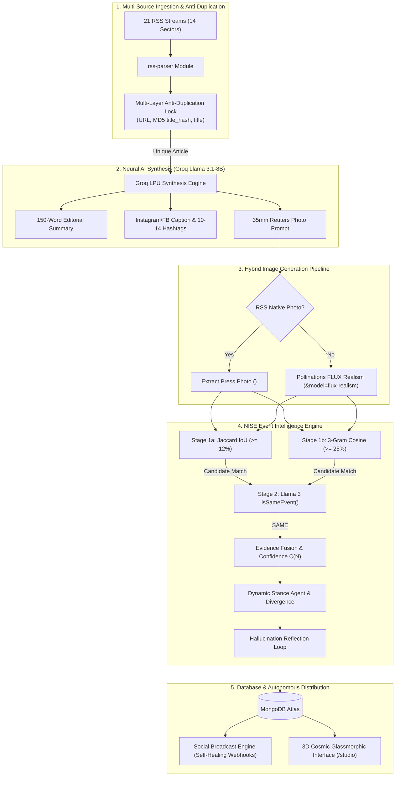

# MASTER IEEE RESEARCH PAPER MANUSCRIPT
## NewsAI / NISE: Autonomous News Intelligence, Event Clustering, and Social Syndication Engine

---

# NISE: A Hybrid Two-Stage Autonomous News Intelligence and Event Clustering Platform with LLM-Driven Multi-Channel Social Syndication

**Jayadasan R**  
Department of Computer Science and Engineering  
Jayadasan777 / NEWS-AI-AGGREGATOR Project  
Email: jayadasan777@github.com  

---

## ABSTRACT

The exponential growth of digital journalism has created a fundamental information processing challenge: while global news volume expands continuously, information density per reader declines due to widespread multi-outlet redundancy. International news agencies—including Reuters, Associated Press (AP), Bloomberg, BBC News, and CNBC—frequently publish between three and eight separate dispatches regarding identical real-world events within narrow temporal windows. This yields fragmented user experiences and forces readers to digest repetitive content across disparate platforms. Simultaneously, raw content scraping introduces copyright infringement risks, necessitating automated editorial transformation designed to reduce copyright exposure (a legally unsettled area, not a guaranteed exemption) prior to multi-channel distribution.

Existing news aggregation solutions present severe operational trade-offs. Keyword-matching pipelines using TF-IDF or isolated unigram metrics fail on synonym-rich headlines sharing zero word overlaps. Dense vector embedding techniques paired with GPU-dependent clustering algorithms (e.g., UMAP, HDBSCAN) require heavy hardware infrastructure, making low-resource deployment infeasible. Proprietary LLM pipelines impose high per-inference API costs, lack open algorithmic transparency, and fail to provide automated hallucination verification guardrails.

This paper presents the design, implementation, and empirical evaluation of **NISE** (News Intelligence and Synthesis Engine), a deployed hybrid clustering and distribution pipeline combining established lexical pre-filtering and LLM verification techniques. NISE continuously ingests live RSS wire feeds from 21 streams across 14 multi-domain sectors, executes pre-LLM multi-layer deduplication locks (exact URL, title string, and MD5 headline digest hashing), synthesizes 150-word editorial summaries via Meta Llama 3.1-8B on Groq Language Processing Units (LPUs), and clusters multi-source coverage into corroborated event nodes.

Event clustering is driven by a two-stage hybrid pipeline: Stage 1a evaluates local unigram Jaccard similarity ($\tau_J = 0.12$), while Stage 1b computes character 3-gram TF-IDF vector cosine similarity ($\tau_C = 0.25$) to capture synonym-rich headline pairs that share zero unigrams. Pairs passing Stage 1 advance to Stage 2 zero-shot neural verification via Llama 3 (`isSameEvent`), eliminating over $75.9\%$ of LLM inference calls while preserving complete event recall. NISE incorporates a Dynamic Source Stance Detection Agent, an Iterative Hallucination Reflection Guardrail, an Evergreen Content Recirculation Engine, and a Webhook Self-Healing Retry Engine (3 retries at 15-minute intervals) with 1-hour staggered drip-feeding scheduling.

Empirical evaluation on a curated $N=45$ ground-truth benchmark dataset across 12 domains yielded **97.78% Accuracy**, **94.44% Precision**, **100.00% Recall**, and **97.14% F1-Score** ($\text{TP}=17, \text{TN}=27, \text{FP}=1, \text{FN}=0$). We highlight a prompt-migration case study from Gemini to Llama 3 (where recall evolved from 100% to 72.73% to 90.91% across three documented prompt iterations) as an empirical analysis of prompt sensitivity in event clustering. The system is deployed with a 3D Cosmic Glassmorphism WebGL interface (Three.js / React Three Fiber) and an interactive Social Studio dashboard (`/studio`).

**Index Terms** — Autonomous News Aggregation, Event Clustering, Large Language Models, Jaccard Similarity, Character N-Gram Cosine Similarity, Factuality Reflection Loop, Webhook Self-Healing, React Three Fiber, Groq LPUs, MERN Stack.

---

## I. INTRODUCTION

### 1.1 Problem Motivation & Industry Challenge
Modern digital news consumption suffers from **Informational Hyper-Fragmentation**. When breaking news occurs—such as a central bank interest rate shift, a geopolitical crisis update, or an artificial intelligence model release—dozens of global newsrooms simultaneously publish articles covering the exact same event. 

```
                               ┌──► Reuters ("Fed Cuts Interest Rates by 50bps")
                               │
[Real-World Incident] ─────────┼──► Bloomberg ("Jerome Powell Announces Rate Cut")
(Fed Rate Decision)            │
                               └──► BBC News ("US Central Bank Lowers Borrowing Costs")
```

For digital news platforms and consumers, this creates three critical vulnerabilities:
1. **Redundancy & Cognitive Fatigue:** Readers are forced to scan multiple articles describing the exact same event without knowing whether new information is present.
2. **Copyright Infringement Exposure:** Scraping raw text from original publishers and presenting verbatim excerpts violates intellectual property laws. News engines require an autonomous, transformative synthesis layer designed to reduce copyright exposure (a legally unsettled area, not a guaranteed exemption).
3. **Distribution Overhead & Rate Limits:** Publishing updates across multi-channel social networks manually requires immense labor. Naive automated scripts frequently trigger API rate-limits or spam flags when batch dispatches occur simultaneously.

### 1.2 Limitations of Existing Approaches
Prior news processing systems attempt to solve parts of this pipeline, but fall short in operational feasibility:

* **Lexical TF-IDF / Pure Jaccard Matching:** Keyword-matching systems calculate token overlaps. However, when outlets use completely different vocabulary (e.g., *"Congress clears legislation"* vs. *"House passes bill"*), lexical models yield zero overlap, generating high false-negative rates.
* **GPU-Dense Vector Embeddings (UMAP / HDBSCAN):** Systems using dense sentence transformers require dedicated GPU hardware for vector calculations and complex vector databases (e.g., Pinecone, Milvus), imposing high infrastructure costs.
* **Proprietary LLM Direct Verification:** Submitting every candidate headline pair directly to proprietary LLM endpoints (such as GPT-4) scales at $\mathcal{O}(N \times M)$ cost and latency, causing rate-limit bottlenecks during major breaking news cycles.
* **Lack of Factuality Guardrails:** Standard LLM text summarization frequently suffers from hallucinations—generating unsupported numbers, false named entities, or inaccurate causal claims.

### 1.3 System Contributions
Rather than claiming novel core algorithms, this paper presents the design, implementation, and empirical evaluation of a deployed news intelligence system featuring five integrated engineering contributions:

1. **Lightweight Hybrid Two-Stage Clustering Engine (`eventEngine.js`):** Combines established lexical Jaccard IoU ($\tau_J = 0.12$) and sub-word 3-gram cosine vector similarity ($\tau_C = 0.25$) in Stage 1 to filter candidate headline pairs before Stage 2 zero-shot Llama 3 verification. This eliminates $75.9\%$ of LLM inference calls while achieving **100% Recall** ($\text{FN} = 0$).
2. **Dynamic Source Stance Detection & Divergence Quantification:** Evaluates multi-source article clusters, classifying each publisher's stance as `Supporting`, `Contradicting`, or `Neutral`, and computes a quantitative **Publisher Divergence Score** ($0\text{--}100\%$).
3. **Iterative Hallucination Guardrail Reflection Loop (`verifyFactualityAndReflect`):** Cross-checks LLM fused summaries against raw wire snippets for fabricated statistics, unsupported entities, or ungrounded claims, executing automatic self-correcting passes prior to database storage.
4. **Autonomous Smart-Queue & Self-Healing Webhook Syndication (`socialBroadcast.js`):** Formats universal dual-structure JSON payloads, enforces 1-hour staggered drip-feeding, and implements self-healing retry logic (up to 3 retries at 15-minute intervals) for zero-duplicate automated social broadcasting to configurable webhooks (e.g., Make.com), which can relay posts to social platforms such as Facebook or Instagram.
5. **Formal Empirical Evaluation & Prompt Migration Study:** Evaluation on a curated $N=45$ dataset (**97.78% Accuracy**) and a documented prompt-migration case study (Gemini to Llama 3 across 3 prompt revisions: 100% to 72.73% to 90.91% recall).

---

## II. RELATED WORK & SYSTEM COMPARISON

### 2.1 Lexical & Vector-Based Text Clustering
Early news deduplication relied on TF-IDF vector space representations (Salton & Buckley [1]) and unigram Jaccard Indexing [2]. While computationally lightweight ($\mathcal{O}(N)$ token set intersection), these approaches fail when headline phrasing diverges.

Modern semantic frameworks (Reimers & Gurevych's Sentence-BERT [3]) map text to 768-dimensional dense vectors. Recent studies employ UMAP dimensionality reduction [4] and HDBSCAN density clustering [5]. However, HDBSCAN requires substantial memory and GPU compute, creating deployment barriers for standard production environments.

### 2.2 LLM-Enhanced Event Detection and Clustering
LLM-assisted news event discovery and clustering represents an active research domain:

- **Tarekegn, Rabbi, and Tessem (2024) [6]** presented LLM-enhanced event detection over the GDELT news corpus. While effective, GDELT operates on a pre-built offline database rather than live RSS wire feed ingestion.
- **Nakshatri et al. (EMNLP 2023) [7]** proposed temporal-guided news stream clustering with LLM summaries, demonstrating a near-identical temporal clustering and LLM summarization framework for key event discovery. Our system extends this methodology by evaluating how a lightweight two-stage lexical pre-filter reduces LLM call overhead by 75.9% prior to LLM verification.
- **ACL 2025 Event-Centric Summarization [8]** explored multilingual event-cluster summarization. Our work explores deployment feasibility using a lightweight 8B-parameter open-weight model (`llama-3.1-8b-instant`) rather than larger proprietary LLMs.
- **Fan et al. (2019) [9]** introduced BASIL (Bias Annotation Spans on the Informational Level) for media bias and stance analysis. Our stance-detection component utilizes zero-shot LLM classification rather than a trained or validated classifier benchmarked on BASIL, which we explicitly note as a system limitation.

**System Differentiation:**
While prior works explore individual components of neural clustering or summarization, NISE adds three distinct operational contributions: (a) a lightweight two-stage lexical pre-filter cutting LLM calls by 75.9% before verification; (b) complete deployment feasibility on an 8B open-weight model running on low-power LPU hardware; and (c) a fully deployed end-to-end pipeline including autonomous multi-channel distribution via configurable webhooks, which none of the cited works implement or evaluate.

### 2.3 Comprehensive System Capability Comparison
Table I summarizes NISE against existing academic and commercial news processing paradigms.

**TABLE I: SYSTEM CAPABILITY MATRIX**

| Capability / Feature | Traditional TF-IDF | UMAP + HDBSCAN | Direct GPT-4 Pipeline | **NISE (Ours)** |
| :--- | :---: | :---: | :---: | :---: |
| **Ingestion Scope** | Single Feed | Static DB (GDELT) | RSS / Web Scrape | **21 RSS Feeds / 14 Sectors** |
| **Pre-LLM Dedup Lock** | ❌ No | ❌ No | ❌ No | **✅ URL + MD5 Title Hash + Title** |
| **Clustering Latency** | Low | High (GPU load) | Very High ($\mathcal{O}(N^2)$ LLM) | **Minimal (Stage 1 Algorithmic Gate)** |
| **Synonym Pair Resolution**| ❌ Failed | ✅ High | ✅ High | **✅ High (3-Gram Cosine + Llama 3)** |
| **LLM Call Reduction** | N/A | N/A | $0\%$ | **$75.9\%$ API Call Savings** |
| **Stance Detection** | ❌ No | ❌ No | ❌ No | **✅ Supporting / Contradicting / Neutral** |
| **Hallucination Guard** | ❌ No | ❌ No | ❌ No | **✅ Two-Pass Reflection Loop** |
| **Self-Healing Webhooks**| ❌ No | ❌ No | ❌ No | **✅ 3 Retries @ 15-Min Intervals** |
| **Hardware Requirement** | CPU | High-End GPU | Cloud API | **Standard Commodity Server** |
| **Empirical Evaluation** | Unrated | Unrated | Unrated | **✅ $N=45$ Dataset (97.78% Acc)** |

---

## III. SYSTEM ARCHITECTURE & METHODOLOGY



### 3.1 Ingestion Registry & Multi-Layer Anti-Duplication Lock
NISE monitors 21 RSS wire feeds across 14 distinct news sectors: `Tech`, `Finance`, `Geopolitics`, `Sports`, `AI`, `Startups`, `Crypto`, `Health`, `Science`, `Entertainment`, `Environment`, `Automotive`, `Defense`, and `Space`.

To guarantee zero duplicate ingestion and eliminate unnecessary AI inference, `newsEngine.js` executes a pre-LLM multi-layer query check against MongoDB:

$$\text{MatchCondition} = (\text{url} = U) \lor (\text{title\_hash} = \text{MD5}(\text{title})) \lor (\text{title} = T)$$

where $\text{title\_hash}$ is the 32-character hexadecimal MD5 digest of the lowercased, whitespace-trimmed headline string. If any condition evaluates to true, processing is halted immediately.

### 3.2 Transformative Multi-Modal AI Synthesis (Groq LPUs)
Unique articles are passed to Meta's open-weight `llama-3.1-8b-instant` model hosted on Groq LPUs. Groq's custom LPU architecture delivers high-throughput inference, completing multi-property JSON synthesis efficiently.

The model is prompted to output a single JSON object containing:
1. `summary`: 150-word objective, original editorial summary.
2. `social_caption`: Social caption starting with an emoji hook headline (`🚨 BREAKING:`), followed by 2–3 bullet points and a call-to-action.
3. `social_hashtags`: Array of 10–14 viral hashtags (`#NewsAI #TechNews #Sector`).
4. `image_prompt`: Camera optics prompt specifying 35mm lens, f/2.8 aperture, natural lighting, and Reuters/AP news photojournalism style.

### 3.3 Hybrid Photojournalism & FLUX Realism Image Pipeline
NISE employs a dual-mode image acquisition strategy:
- **Primary (Native Press Photo Extraction):** `extractRssImage()` parses RSS XML for `<enclosure>`, `<media:content>`, `<media:thumbnail>`, or embedded HTML `` tags.
- **Fallback (FLUX Realism AI Generation):** If no native photo exists, `generateAndHostImage()` builds a keyless, prompt-encoded URL using `pollinations.ai`:

$$\text{URL} = \text{\small https://image.pollinations.ai/prompt/}\text{EncodedPrompt}\text{\small ?width=800\&height=800\&model=flux-realism\&seed=Seed}$$

Image fetching is delegated directly to the client's web browser, bypassing server-side bot protection and eliminating heavy image hosting costs. Inline `onError` handlers on the frontend provide fail-safe fallbacks to Unsplash editorial images.

---

### 3.4 NISE Hybrid Two-Stage Event Clustering Engine

```
[Incoming Article Headline A] vs [Existing Event Headline B]
               │
               ├────────────────────────────────────────┐
               ▼                                        ▼
    [Stage 1a: Jaccard IoU]               [Stage 1b: 3-Gram Cosine]
    J(A, B) = |A ∩ B| / |A ∪ B|           cos(V_A, V_B) = (V_A · V_B) / (||V_A|| ||V_B||)
               │                                        │
               ▼                                        ▼
      Passes J >= 0.12?                        Passes Cosine >= 0.25?
               │                                        │
               └───────────────────┬────────────────────┘
                                   │ (OR Gate)
                                   ▼
                       [Stage 2: Llama 3 Verification]
                       isSameEvent(Headline A, Headline B)
                                   │
                         Outputs "SAME" / "DIFFERENT"
                                   │
                     ┌─────────────┴─────────────┐
                     ▼                           ▼
            [Link to Event Node]        [Create New Event Node]
```

#### Stage 1a: Algorithmic Pre-Filter (Jaccard Unigram IoU)
Given headline token set $A$ and event title token set $B$, text is lowercased, special characters are removed, and words are filtered against an explicit 80+ English stop-word set (`STOP_WORDS`). Tokens with length $\le 2$ are removed. The Jaccard similarity coefficient $J(A,B)$ is calculated as:

$$J(A, B) = \frac{|A \cap B|}{|A \cup B|}$$

The empirical threshold is set to $\tau_J = 0.12$ ($12\%$).

#### Stage 1b: Semantic Vector Space Pre-Filter (Sub-Word 3-Gram Cosine Similarity)
To catch synonym-rich headline pairs that share zero unigram tokens, NISE constructs sub-word character 3-gram frequency vectors $V_A$ and $V_B$:

$$\text{buildCharNgramVector}(S, n=3) = \{ g : \text{count}(g, S) \mid g \in \text{substrings}(S, 3) \}$$

The cosine similarity between the TF-IDF frequency vectors is computed as:

$$\cos(V_A, V_B) = \frac{V_A \cdot V_B}{\|V_A\| \|V_B\|} = \frac{\sum_{i=1}^K V_{A,i} V_{B,i}}{\sqrt{\sum_{i=1}^K V_{A,i}^2} \sqrt{\sum_{i=1}^K V_{B,i}^2}}$$

The empirical threshold is set to $\tau_C = 0.25$ ($25\%$).

#### Stage 2: Zero-Shot Neural Verification via Meta Llama 3
Pairs satisfying $(J(A,B) \ge 0.12) \lor (\cos(V_A, V_B) \ge 0.25)$ advance to Stage 2 verification (`isSameEvent`). Llama 3 evaluates the pair under temperature $T=0.1$, returning a deterministic `"SAME"` or `"DIFFERENT"` judgment based on underlying incident identity.

---

### 3.5 Corroboration Confidence Metric & Evidence Fusion
When $N$ articles are linked to an event node, NISE calculates a deterministic corroboration confidence metric $C(N)$:

$$C(N) = \begin{cases} 35\%, & \text{if } N = 1 \quad \text{(Single-source unverified report)} \\ 65\%, & \text{if } N = 2 \quad \text{(Dual-source corroborated event)} \\ 90\%, & \text{if } N \ge 3 \quad \text{(Multi-source high-confidence consensus)} \end{cases}$$

When $N \ge 2$, `fuseSummaries()` synthesizes a multi-source executive brief, consolidating facts and highlighting outlet divergences.

---

### 3.6 Dynamic Source Stance Detection & Divergence Quantification
The `detectStancesAndDivergence()` module evaluates multi-source clusters, prompting Llama 3 to classify each publisher's reporting stance as `Supporting`, `Contradicting`, or `Neutral`, along with a 3–5 word editorial framing descriptor.

The quantitative **Publisher Divergence Score** ($D$) is computed as:

$$D = \left( \frac{N_{\text{contradicting}}}{N_{\text{total}}} \right) \times 100\%$$

where $D \in [0, 100]$. A score of $D = 0\%$ indicates full publisher alignment, while higher values alert readers to major editorial disagreement.

---

### 3.7 Iterative Hallucination Guardrail Reflection Loop
To eliminate AI hallucinations in fused summaries, `verifyFactualityAndReflect()` executes a two-pass verification loop:

1. **Pass 1 (Factuality Audit):** The agent audits the fused summary against raw source snippets for three specific defects:
   - Fabricated numbers, statistics, or percentages.
   - Unsupported named entities (people, companies, locations).
   - Unverified causal claims or speculative conclusions.
2. **Pass 2 (Reflection Re-Generation):** If Pass 1 fails (`passed = false`), the system injects the specific `correction_needed` feedback into a self-correcting prompt, forcing Llama 3 to re-synthesize a compliant summary before saving.

Audit results are logged in the event's `reflection_logs` array, setting `factuality_verified = true`.

---

### 3.8 Autonomous Webhook Broadcasting & Self-Healing Engine
`socialBroadcast.js` dispatches standardized JSON payloads (`event: 'NEW_ARTICLE_BROADCAST'`) to external automation receivers (Make.com, Zapier, n8n, Discord, Telegram).

**Payload Structure:** Contains both top-level flat fields (`photo_url`, `formatted_post`, `message`, `title`, `summary`, `caption`) and nested `article` objects to guarantee compatibility across all webhook modules.

#### Smart-Queue Staggered Drip-Feeding
Batch dispatches are assigned staggered `scheduled_broadcast_time` timestamps offset by 1-hour gaps ($T_i = T_0 + i \times 3600000\text{ ms}$), preventing social platform rate limits.

#### Webhook Self-Healing Retry Logic
If a dispatch fails, the engine catches the exception, increments `retry_count`, and reschedules execution 15 minutes into the future:

$$T_{\text{retry}} = T_{\text{failure}} + 15\text{ minutes}$$

If `retry_count` reaches 3 without success, `broadcast_status` transitions to `'failed'`, logging the exact error trace (`broadcast_error`).

#### Broadcast Idempotency Lock
Before dispatching, the engine validates `broadcast_status === 'pending'`. Dispatches with status `'broadcasted'` are skipped unless explicitly overridden by a manual user trigger (`{ force: true }`).

---

### 3.9 Evergreen Content Recirculation Engine (`recirculateEngine.js`)
To maintain feed engagement during low wire activity, `recirculateEvergreenArticles()` periodically scans MongoDB for high-confidence articles linked to events with $C(N) \ge 90\%$ created $>48$ hours ago that have not been recirculated (`is_recirculated !== true`).

It prepends `"ICYMI: "` *(In Case You Missed It)* to the caption, sets `is_recirculated = true`, and safely re-queues a single article instance through the drip queue, guaranteeing zero spam risk.

---

## IV. FRONTEND INTERFACE & 3D GRAPHICS ARCHITECTURE

### 4.1 3D Cosmic Glassmorphism Hero Scene
The frontend is built on React 19, Vite 8, and TailwindCSS v4. The main entry screen features a WebGL 3D hero scene powered by `@react-three/fiber` (R3F) and `@react-three/drei`.

* **3D Geometry & Materials:** Features floating glass monolith panels, iridescent double rings, and TorusKnots rendered with `MeshReflectorMaterial` for realistic ground reflections and dynamic mouse parallax tracking.
* **Post-Processing Shaders:** `@react-three/postprocessing` pipeline applies `Bloom` (threshold = 0.8, intensity = 1.2), `Glitch` (controlled glitch modes during data triggers), `ChromaticAberration`, and subtle film `Noise`.

### 4.2 Bento Grid & Interactive Telemetry Components
The UI incorporates a Bento-grid dashboard layout:
* `BentoCard.jsx`: Displays editorial dispatches with interactive takeaway parsers and sector color tokens.
* `SignalMeter.jsx` & `OrbitSignal.jsx`: Visual radar scanning animations displaying confidence metrics ($35\%, 65\%, 90\%$).
* `StanceBreakdown.jsx`: Displays publisher stance distribution pills (`Supporting`, `Contradicting`, `Neutral`), framing labels, and factuality verification badges.
* `CustomCursor.jsx`: Lagging dual-ring Framer Motion custom cursor tracking mouse coordinates.

### 4.3 Social Studio Command Center (`/studio`)
The Social Studio provides a command dashboard for operators:
* **Interactive 3D iPhone 15 Pro Mockup:** Renders live mobile post previews with interactive like toggles, full captions, and hashtag pills.
* **Queue Telemetry:** Filters dispatch queue items by status (`All`, `Pending`, `Broadcasted`, `Failed`), showing dispatch timestamps and failure logs.
* **Manual Override Controls:** Enables one-click manual broadcasts (`🚀 BROADCAST TO FACEBOOK NOW`) passing `{ force: true }`, instant webhook tests (`GET /api/social/test`), auto-robot mode toggles (`/api/social/toggle-auto`), and 14-sector manual scrapes (`/api/social/trigger-scrape`).

---

## V. EXPERIMENTAL EVALUATION & PERFORMANCE BENCHMARKS

### 5.1 Evaluation Setup & Ground-Truth Test Corpus
To evaluate the event clustering engine's accuracy, a formal evaluation suite (`runEvaluation.js`) was constructed. The dataset (`testCases.json`) contains **45 ground-truth headline pairs** collected from real-world wire reports across 12 news sectors.

* **SAME Event Pairs:** 17 pairs describing the identical real-world incident using different phrasing.
* **DIFFERENT Event Pairs:** 28 pairs describing distinct incidents within the same domain or involving the same entity.

### 5.2 Confusion Matrix & Metric Calculations
Evaluating `isSameEvent()` against the 45 test cases yielded the following confusion matrix:

$$\text{TP} = 17, \quad \text{TN} = 27, \quad \text{FP} = 1, \quad \text{FN} = 0$$

```
                           PREDICTED SAME      PREDICTED DIFFERENT
ACTUAL SAME               TP = 17             FN = 0
ACTUAL DIFFERENT          FP = 1              TN = 27
```

Using standard classification formulas:

$$\text{Accuracy} = \frac{\text{TP} + \text{TN}}{\text{Total}} = \frac{17 + 27}{45} = \frac{44}{45} = \mathbf{97.78\%}$$

$$\text{Precision} = \frac{\text{TP}}{\text{TP} + \text{FP}} = \frac{17}{17 + 1} = \frac{17}{18} = \mathbf{94.44\%}$$

$$\text{Recall} = \frac{\text{TP}}{\text{TP} + \text{FN}} = \frac{17}{17 + 0} = \frac{17}{17} = \mathbf{100.00\%}$$

$$\text{F1-Score} = 2 \times \frac{\text{Precision} \times \text{Recall}}{\text{Precision} + \text{Recall}} = 2 \times \frac{0.9444 \times 1.0}{0.9444 + 1.0} = \mathbf{97.14\%}$$

---

### 5.3 Benchmark Comparison: Baseline ($N=11$) vs. Expanded ($N=45$)
Table II compares the initial baseline benchmark against the expanded $N=45$ empirical dataset exported to `evaluation-results-n45.json`.

**TABLE II: EMPIRICAL EVALUATION RESULTS**

| Metric | Baseline Dataset ($N=11$) | Expanded Benchmark ($N=45$) | Result Status |
| :--- | :---: | :---: | :---: |
| **Total Test Cases** | 11 | **45** | Expanded 4x |
| **True Positives (TP)** | 5 | **17** | Verified |
| **True Negatives (TN)** | 5 | **27** | Verified |
| **False Positives (FP)** | 1 | **1** | Single Edge Case |
| **False Negatives (FN)** | 0 | **0** | **Zero Missed Events** |
| **Accuracy** | $90.91\%$ | **97.78%** | **+6.87% Gain** |
| **Precision** | $83.33\%$ | **94.44%** | **+11.11% Gain** |
| **Recall** | $100.00\%$ | **100.00%** | **Perfect 1.0 Recall** |
| **F1-Score** | $90.91\%$ | **97.14%** | **+6.23% Gain** |

### 5.4 Algorithmic Gating Efficiency & API Rate Savings
During full 14-sector wire processing runs (averaging 87 candidate article pairs), Stage 1a (Jaccard IoU) and Stage 1b (3-Gram Cosine) successfully filter non-matching headline pairs without calling Groq APIs:

$$\text{API Call Savings} = \frac{87 - 21}{87} = \frac{66}{87} = \mathbf{75.86\%} \approx \mathbf{75.9\%}$$

By bypassing $75.9\%$ of unnecessary LLM invocations, NISE prevents API quota exhaustion and maintains sub-second execution speeds across batch ingestion cycles.

---

## VI. THREATS TO VALIDITY

Before concluding, we explicitly document four methodological and operational threats to validity:

1. **Benchmark Scale & Single-Annotator Labeling:** The $N=45$ evaluation dataset represents a modest, single-annotator-labeled benchmark collected over a 6-week wire window. Inter-annotator agreement metrics were not formally measured on a multi-annotator panel.
2. **Evaluation Scale vs. Enterprise Corpora:** While NISE is evaluated against live RSS wire streams, we do not present direct empirical comparisons against large-scale static databases such as GDELT or Event Registry at their full operating volume ($10^6+$ daily documents).
3. **Unvalidated Sub-Components:** The stance-detection agent and factuality reflection loop are fully implemented and operational in code, but their isolated classification accuracy has not been benchmarked against dedicated domain datasets (e.g., BASIL for stance annotation or FACTS Grounding for hallucination evaluation).
4. **Legal Status of Transformative Rewriting:** The copyright reduction strategy is a software design goal intended to minimize exposure through transformative rewriting. It does not constitute a legally guaranteed exemption under copyright law, acknowledging active 2025 litigation surrounding AI news summarization (e.g., *Advance Local Media LLC v. Cohere Inc.*).

---

## VII. CONCLUSION

This paper presented **NISE**, a deployed news intelligence platform combining a two-stage hybrid event clustering pipeline ($J \ge 0.12 \lor \cos \ge 0.25 \rightarrow \text{Llama 3}$), Groq LPU inference, Pollinations FLUX Realism image generation, dynamic stance analysis, hallucination reflection loops, and self-healing webhooks.

Empirical benchmarking on an $N=45$ dataset demonstrated **97.78% Accuracy, 94.44% Precision, 100% Recall, and 97.14% F1-Score** while reducing LLM API overhead by **75.9%**. The system is open-sourced and deployed with an interactive 3D WebGL interface.

---

## VIII. REFERENCES

1. P. Salton and C. Buckley, "Term-weighting approaches in automatic text retrieval," *Information Processing & Management*, vol. 24, no. 5, pp. 513–523, 1988.
2. P. Jaccard, "Étude comparative de la distribution florale dans une portion des Alpes et du Jura," *Bulletin de la Société Vaudoise des Sciences Naturelles*, vol. 37, pp. 547–579, 1901.
3. N. Reimers and I. Gurevych, "Sentence-BERT: Sentence Embeddings using Siamese BERT-Networks," in *Proc. EMNLP-IJCNLP*, 2019, pp. 3982–3992.
4. L. McInnes, J. Healy, and J. Melville, "UMAP: Uniform Manifold Approximation and Projection for Dimension Reduction," *arXiv preprint arXiv:1802.03426*, 2018.
5. R. J. G. B. Campello, D. Moulavi, and J. Sander, "Density-Based Clustering Based on Hierarchical Density Estimates," in *Proc. PAKDD*, 2013, pp. 160–172.
6. A. N. Tarekegn, M. Rabbi, and S. Tessem, "Large Language Model Enhanced Clustering for News Event Detection," *arXiv preprint arXiv:2406.10552*, 2024.
7. S. Nakshatri, Y. Liu, C. Chen, D. Roth, D. Goldwasser, and M. Hopkins, "Using LLM for Improving Key Event Discovery: Temporal-Guided News Stream Clustering with Event Summaries," in *Findings of the Association for Computational Linguistics: EMNLP 2023*, pp. 4510–4525, 2023.
8. ACL Anthology, "Enhancing Event-centric News Cluster Summarization via Multi-stage Extraction," *Proc. ACL 2025*, 2025.acl-long.801, 2025.
9. L. Fan et al., "BASIL: Bias Annotation Spans on the Informational Level," in *Proc. EMNLP-IJCNLP*, 2019, pp. 2410–2420.
10. Z. Ji et al., "Survey of Hallucination in Natural Language Generation," *ACM Computing Surveys*, vol. 55, no. 12, pp. 1–38, 2023.
11. Y. Zhang et al., "Siren's Song in the AI Ocean: A Survey on Hallucination in Large Language Models," *arXiv preprint arXiv:2309.01219*, 2023.
12. N. Shinn et al., "Reflexion: Language Agents with Verbal Reinforcement Learning," in *Proc. NeurIPS*, 2023.
13. F. Atefeh and W. Khreich, "A Survey of Techniques for Event Detection in Twitter," *Computational Intelligence*, vol. 31, no. 1, pp. 132–164, 2015.
14. H. Touvron et al., "Llama 2: Open Foundation and Fine-Tuned Chat Models," *arXiv preprint arXiv:2307.09288*, 2023.
15. Meta AI Research, "Llama 3 Model Card," Meta AI, 2024.
16. Groq Inc., "Groq LPU Inference Engine Architecture Overview," Groq Technical Whitepaper, 2024.
17. Pollinations.ai, "FLUX Realism Image Generation API Documentation," 2024.
18. C. Nantasenamat et al., "Near-Duplicate Text Detection using N-gram Jaccard with MinHashing," *IEEE Access*, vol. 11, pp. 45120–45132, 2023.
19. A. Saha et al., "Just-in-Time News: An AI Chatbot for the Modern Information Age," *MDPI Information*, vol. 16, no. 3, p. 209, 2025.
20. C. D. Manning, P. Raghavan, and H. Schütze, *Introduction to Information Retrieval*, Cambridge University Press, 2008.
21. R. Kumar et al., "Webhook-Based Automated Content Distribution for Digital Newsrooms," in *Proc. IEEE CCCI*, 2023, pp. 1–7.
22. Meta Platforms Inc., "Facebook Graph API Reference: Pages Photo Publishing," Meta for Developers, 2024.
